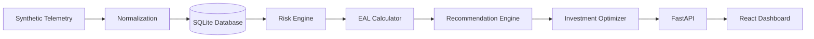
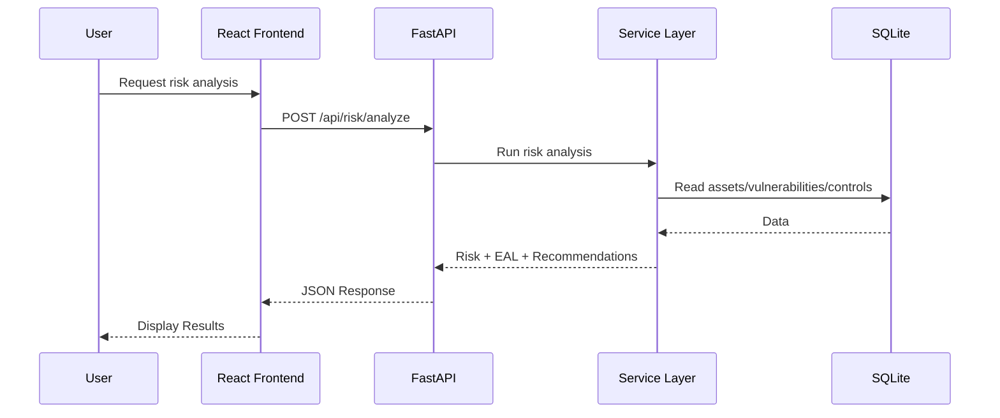
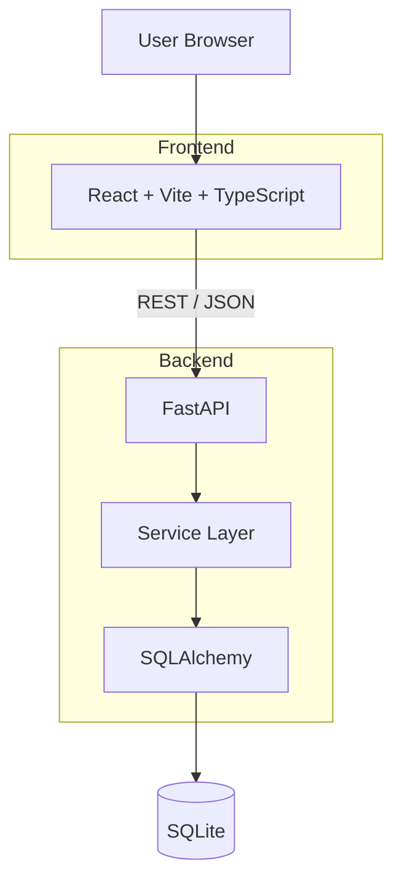
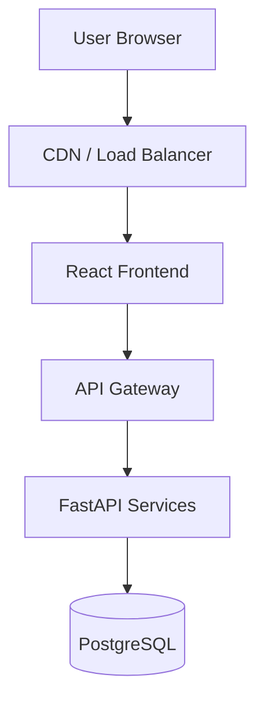
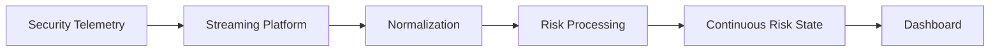
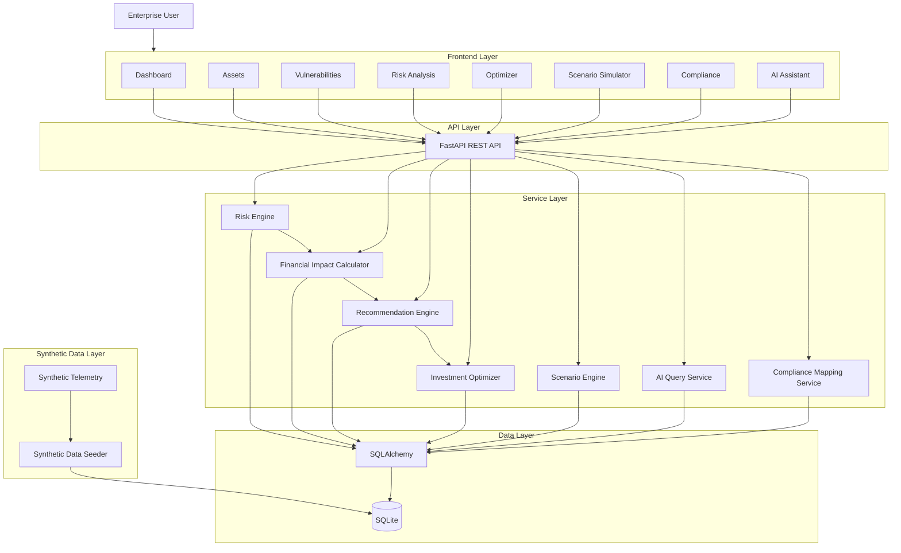

# CyberQuant AI — Architecture

## 1. Frontend Layer

CyberQuant AI uses **React + Vite + TypeScript** for the frontend.

The frontend is responsible for presenting risk information, collecting user inputs, triggering API requests, and displaying analysis results.

### Components

| Component | Responsibility |
|---|---|
| Dashboard | Executive overview of cyber risk, EAL, financial exposure, and recommendations |
| Assets | View enterprise assets, criticality, and asset details |
| Vulnerabilities | View vulnerabilities, severity, affected assets, and remediation status |
| Risk Analysis | Display risk scores, risk levels, and Expected Annual Loss (EAL) |
| Optimizer | Display recommended security investments and expected risk reduction |
| Scenario Simulator | Run what-if scenarios and compare risk outcomes |
| Compliance | Display security controls and framework mappings |
| AI Assistant | Allow natural-language queries about assets, risks, vulnerabilities, and recommendations |

### Suggested Frontend Structure

```text
frontend/
├── src/
│   ├── components/
│   ├── pages/
│   │   ├── Dashboard/
│   │   ├── Assets/
│   │   ├── Vulnerabilities/
│   │   ├── RiskAnalysis/
│   │   ├── Optimizer/
│   │   ├── ScenarioSimulator/
│   │   ├── Compliance/
│   │   └── AIAssistant/
│   ├── services/
│   │   └── api.ts
│   ├── types/
│   ├── hooks/
│   └── utils/
├── package.json
└── vite.config.ts
```

The frontend should **not implement core risk or financial calculations**. It should consume calculated results from the backend and focus on presentation and user interaction.

---

# 2. API Layer

The backend exposes **REST APIs using FastAPI**.

The API layer acts as the boundary between the React frontend and backend services.

### Responsibilities

- Receive HTTP requests
- Validate request payloads
- Call the appropriate service
- Return JSON responses
- Handle API-level errors
- Convert service exceptions into HTTP responses

### API Structure

```text
/api/assets
/api/vulnerabilities
/api/risk
/api/financial-impact
/api/recommendations
/api/optimizer
/api/scenarios
/api/compliance
/api/ai
```

### Example Endpoints

| Method | Endpoint | Purpose |
|---|---|---|
| GET | `/api/assets` | List all assets |
| GET | `/api/assets/{id}` | Get a specific asset |
| GET | `/api/vulnerabilities` | List vulnerabilities |
| POST | `/api/risk/analyze` | Calculate risk |
| GET | `/api/risk/summary` | Get overall risk summary |
| GET | `/api/recommendations` | Get security recommendations |
| POST | `/api/optimizer/optimize` | Optimize security investments |
| POST | `/api/scenarios/simulate` | Run a what-if scenario |
| GET | `/api/compliance/mappings` | Get compliance mappings |
| POST | `/api/ai/query` | Ask the AI assistant a question |

---

# 3. Service Layer

The service layer contains the core business logic of CyberQuant AI.

FastAPI route handlers should remain thin and delegate calculations to services.

## 3.1 Risk Engine

The Risk Engine calculates cyber risk using factors such as:

- Asset criticality
- Asset exposure
- Vulnerability severity
- Vulnerability exploitability
- Control effectiveness
- Threat likelihood
- Business impact

```text
Asset
   +
Vulnerabilities
   +
Controls
   +
Threat Factors
        ↓
   Risk Engine
        ↓
Risk Score + Risk Level
```

The risk engine should be deterministic for the MVP so that the same input produces the same result.

---

## 3.2 Financial Impact Calculator

The Financial Impact Calculator converts cyber risk into financially meaningful measurements.

The primary MVP metric is:

**Expected Annual Loss (EAL)**

Simplified formula:

```text
EAL = Probability of Loss × Financial Impact
```

The calculation may later incorporate:

- Incident response cost
- Downtime cost
- Data loss cost
- Regulatory penalties
- Reputation impact
- Recovery cost

For the MVP, the formula should remain simple and explainable.

---

## 3.3 Recommendation Engine

The Recommendation Engine identifies security improvements based on:

- High-risk assets
- Critical vulnerabilities
- Weak controls
- Expected risk reduction
- Financial impact
- Mitigation cost

Example recommendations:

```text
Patch critical vulnerability
Enable MFA
Improve backup controls
Deploy endpoint protection
Improve network segmentation
Increase security monitoring
```

Each recommendation should contain:

```text
Recommendation
├── Reason
├── Affected Asset
├── Related Risk
├── Mitigation
├── Estimated Cost
└── Expected Risk Reduction
```

---

## 3.4 Investment Optimizer

The Investment Optimizer determines how a limited cybersecurity budget can be allocated across available mitigations.

```text
Available Budget
       ↓
Possible Mitigations
       ↓
Cost + Risk Reduction
       ↓
Optimization Algorithm
       ↓
Recommended Investment Portfolio
```

For the MVP, a simple greedy or score-based optimization algorithm is sufficient.

The MVP does **not** require advanced mathematical optimization or machine learning.

---

## 3.5 Scenario Engine

The Scenario Engine supports what-if analysis.

Examples:

```text
What happens if critical vulnerabilities increase by 20%?

What happens if ₹10 lakh is invested in endpoint security?

What happens if MFA is enabled?

What happens if a critical control becomes ineffective?
```

The scenario engine should:

1. Receive scenario parameters.
2. Create a temporary scenario state.
3. Recalculate risk.
4. Recalculate EAL.
5. Compare against the baseline.
6. Return the results.

Scenario execution should **not permanently modify production data**.

```text
Current State
     ↓
Scenario Changes
     ↓
Temporary State
     ↓
Risk Engine
     ↓
EAL Calculator
     ↓
Scenario Result
```

---

## 3.6 AI Query Service

The AI Query Service processes natural-language questions from the AI Assistant.

```text
User
  ↓
AI Query Service
  ↓
Risk / Database Services
  ↓
Structured Context
  ↓
AI Model
  ↓
Natural Language Response
```

The AI service should use application data as context rather than inventing risk information.

Examples of supported questions:

```text
Which assets are most risky?
What is our current EAL?
Why is the payment server high risk?
What should we fix first?
How should we spend our cybersecurity budget?
What happens if we enable MFA?
```

### AI Fallback

The application should remain functional if an external AI provider is unavailable.

```text
AI Query
   ↓
AI Provider
   ↓
Unavailable
   ↓
Fallback Query Logic
   ↓
Database / Risk Engine
   ↓
Deterministic Response
```

---

## 3.7 Compliance Mapping Service

The Compliance Mapping Service maps cybersecurity controls to compliance frameworks.

```text
Security Control
       ↓
Framework Mapping
       ↓
Framework Requirement
```

The MVP can use seeded mappings for selected frameworks.

The service should provide:

- Frameworks
- Requirements
- Controls
- Control-to-framework mappings
- Implementation status

---

# 4. Data Layer

CyberQuant AI uses:

- **SQLite** for persistence
- **SQLAlchemy** as the ORM

### Data Flow

```text
FastAPI
   ↓
Service Layer
   ↓
SQLAlchemy
   ↓
SQLite
```

### Core SQLAlchemy Models

```text
Asset
Vulnerability
Control
Mitigation
RiskAssessment
RiskScenario
Recommendation
Investment
ComplianceFramework
FrameworkControlMapping
AuditLog
```

### Simplified Relationships

```text
Asset
 ├── Vulnerabilities
 ├── Controls
 └── Risk Assessments

Vulnerability
 └── Mitigations

Mitigation
 ├── Cost
 ├── Expected Risk Reduction
 └── Recommendations

Compliance Framework
 └── Control Mappings
```

Business calculations should remain in the service layer rather than inside database models.

---

# 5. Synthetic Data Layer

The MVP must work without requiring real enterprise integrations.

A synthetic data seeder should populate the database with realistic enterprise data.

## 5.1 Synthetic Assets

Example assets:

```text
Payment Server
Customer Database
Employee Laptop
Production API
Web Application
Cloud Storage
Internal Network
HR Database
```

Each asset may contain:

```text
id
name
type
description
business_criticality
business_value
exposure
owner
environment
```

## 5.2 Synthetic Vulnerabilities

Vulnerabilities should contain:

```text
id
cve_id
title
description
severity
cvss_score
exploitability
affected_asset
remediation_status
```

## 5.3 Synthetic Controls

Example controls:

```text
Multi-Factor Authentication
Endpoint Protection
Network Segmentation
Backup
Patch Management
Access Control
Security Monitoring
Encryption
```

Controls should have an effectiveness value that can influence risk calculations.

## 5.4 Synthetic Mitigations

Each mitigation should contain:

```text
id
name
description
cost
expected_risk_reduction
implementation_effort
```

## 5.5 Framework Mappings

Seed mappings between controls and compliance frameworks.

The synthetic dataset should be large enough to make the dashboard and optimizer meaningful while remaining small enough for fast local development.

---

# 6. Data Flow

The primary MVP data flow is:



## Detailed Flow

### Step 1 — Synthetic Telemetry

Synthetic enterprise data represents:

- Assets
- Vulnerabilities
- Controls
- Security events
- Business impact

### Step 2 — Normalization

```text
Raw Data
   ↓
Validation
   ↓
Normalization
   ↓
Internal Data Model
```

### Step 3 — Persistence

Normalized information is stored using SQLAlchemy in SQLite.

### Step 4 — Risk Calculation

The Risk Engine reads:

```text
Assets
Vulnerabilities
Controls
Threat Factors
```

and calculates:

```text
Risk Score
Risk Level
```

### Step 5 — Financial Risk

```text
Risk
 ↓
Loss Probability
 ↓
Potential Financial Impact
 ↓
Expected Annual Loss
```

### Step 6 — Recommendations

The Recommendation Engine identifies possible security mitigations.

### Step 7 — Optimization

```text
Budget
+
Mitigation Costs
+
Expected Risk Reduction
        ↓
Recommended Investment Allocation
```

### Step 8 — Dashboard

FastAPI returns calculated results to the React frontend.

The dashboard displays:

- Overall risk
- EAL
- Top risks
- High-risk assets
- Critical vulnerabilities
- Recommendations
- Investment allocation
- Scenario results

---

# 7. Frontend/Backend Communication

React and FastAPI communicate using:

**REST + JSON over HTTP**



## Responsibility Ownership

| Responsibility | Owner |
|---|---|
| Risk calculations | Backend |
| Financial calculations | Backend |
| Optimization | Backend |
| Business rules | Backend |
| Request validation | FastAPI/Pydantic |
| Persistence | Backend |
| Database operations | SQLAlchemy |
| Data visualization | Frontend |
| Navigation | Frontend |
| User interaction | Frontend |
| Presentation formatting | Frontend |

### Important Rule

The frontend must **not be the source of truth for risk or financial calculations**.

---

# 8. Error Handling

CyberQuant AI should use consistent API error responses.

## 8.1 API Errors

Common HTTP errors:

```text
400 Bad Request
404 Not Found
409 Conflict
422 Validation Error
500 Internal Server Error
503 Service Unavailable
```

Example:

```json
{
  "error": {
    "code": "RESOURCE_NOT_FOUND",
    "message": "Asset not found"
  }
}
```

## 8.2 Validation Errors

FastAPI/Pydantic should validate:

- Required fields
- Data types
- Numeric ranges
- IDs
- Budget values
- Scenario parameters

## 8.3 Database Errors

Database exceptions should:

1. Be caught by the backend.
2. Be logged internally.
3. Not expose database implementation details.
4. Return a safe API response.

Example:

```json
{
  "error": {
    "code": "DATABASE_ERROR",
    "message": "Unable to complete the requested operation"
  }
}
```

## 8.4 AI Unavailable Fallback

If the AI provider is unavailable, use deterministic information from the database and risk engine.

---

# 9. Security

The MVP should implement basic security practices without unnecessary infrastructure.

## 9.1 Environment Variables

Configuration and secrets must be stored in environment variables.

Example:

```text
DATABASE_URL
AI_API_KEY
CORS_ORIGINS
APP_ENV
```

Never commit real secrets to source control.

Create:

```text
.env
.env.example
```

`.env.example` should contain placeholders only.

## 9.2 Input Validation

All API inputs must be validated before reaching business logic.

Use Pydantic schemas for request validation.

Examples:

```text
Budget > 0
Risk score between 0 and 100
Valid asset ID
Valid vulnerability ID
Valid scenario parameters
```

## 9.3 CORS Configuration

Configure CORS explicitly for the frontend.

Development:

```text
http://localhost:5173
```

Do not use unrestricted CORS in production.

## 9.4 Audit-Friendly Logs

Log important application events:

```text
Risk analysis requested
Scenario executed
Optimization executed
Recommendation generated
AI query executed
Database operation failed
```

Logs should not contain API keys, passwords, or secrets.

---

# 10. MVP Deployment Architecture

The hackathon MVP should remain simple and runnable on a single machine.



## Local Development

```text
Frontend:
http://localhost:5173

Backend:
http://localhost:8000

API Documentation:
http://localhost:8000/docs

Database:
backend/data/cyberquant.db
```

---

# 11. Future Architecture

The MVP intentionally avoids complex infrastructure.

## 11.1 PostgreSQL

SQLite can eventually be replaced with PostgreSQL when:

- Dataset size increases
- Multiple users require concurrent access
- Production reliability requirements increase

```text
SQLite
   ↓
PostgreSQL
```

SQLAlchemy allows most application-level database code to remain unchanged.

## 11.2 Message Queues

Asynchronous processing can later be introduced.

```text
Security Telemetry
       ↓
Message Queue
       ↓
Processing Workers
       ↓
Risk Engine
       ↓
Updated Risk State
```

Possible technologies include Kafka, RabbitMQ, or cloud queues.

These are **not required for the MVP**.

## 11.3 Real Telemetry Connectors

Synthetic telemetry can eventually be replaced by real integrations.

Potential sources:

```text
Cloud Providers
SIEM
EDR
Vulnerability Scanners
CMDB
Identity Providers
Network Monitoring
```

Future flow:

```text
Real Telemetry
      ↓
Connectors
      ↓
Normalization
      ↓
CyberQuant AI
```

## 11.4 Cloud Deployment

The application could eventually evolve into:



## 11.5 Streaming

Continuous cyber risk quantification can eventually use streaming telemetry.



## 11.6 ML Models

The deterministic MVP risk engine can eventually be enhanced with machine-learning models for:

- Breach probability prediction
- Anomaly detection
- Vulnerability exploitation prediction
- Financial loss estimation
- Risk trend forecasting
- Investment optimization

```text
MVP:

Risk Engine
    ↓
Deterministic Formula


Future:

Risk Engine
    ↓
ML Model + Deterministic Rules
    ↓
Risk Prediction
```

---

# 12. Architecture Principles

CyberQuant AI follows these principles for the hackathon MVP:

1. **Keep the architecture simple.**
2. **Keep business logic in backend services.**
3. **Keep presentation logic in the frontend.**
4. **Use REST/JSON for frontend-backend communication.**
5. **Use SQLite + SQLAlchemy for fast local development.**
6. **Use synthetic data so the platform works immediately.**
7. **Make financial risk a first-class output.**
8. **Keep AI optional rather than making it a single point of failure.**
9. **Keep calculations deterministic and explainable for the MVP.**
10. **Design service interfaces so production technologies can be introduced later.**
11. **Do not add PostgreSQL, Kafka, Kubernetes, streaming infrastructure, or ML pipelines to the MVP unless required.**

---

# 13. Overall Architecture



---

# 14. MVP Technology Stack

| Layer | Technology |
|---|---|
| Frontend | React |
| Build Tool | Vite |
| Frontend Language | TypeScript |
| Backend | FastAPI |
| Backend Language | Python |
| API Style | REST |
| Data Format | JSON |
| ORM | SQLAlchemy |
| Database | SQLite |
| Validation | Pydantic |
| AI | Optional external LLM API |
| Data | Synthetic seed data |

The MVP should prioritize **working functionality, explainability, clean architecture, and a strong demo** over infrastructure complexity.
