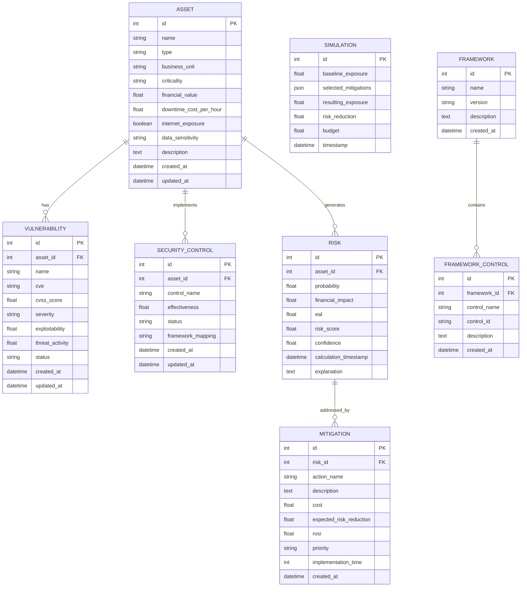

# CyberQuant AI — MVP Database Schema

## 1. Overview

CyberQuant AI uses **SQLite + SQLAlchemy** for the MVP database.

The schema is intentionally small and contains only the entities required for the core hackathon workflow:

```text
Asset
Vulnerability
SecurityControl
Risk
Mitigation
Simulation
Framework
FrameworkControl
```

The database supports:

- Enterprise asset inventory
- Vulnerability tracking
- Security control effectiveness
- Cyber risk calculation
- Expected Annual Loss (EAL)
- Security mitigation recommendations
- Investment/ROSI analysis
- What-if simulations
- NIST CSF mappings
- Future compliance frameworks

### MVP Database Flow

```text
Assets
  ↓
Vulnerabilities + Security Controls
  ↓
Risk Calculation
  ↓
Risk + EAL
  ↓
Mitigations
  ↓
Simulation / Optimization
  ↓
Dashboard
```

---

# 2. Entity Overview

| Entity | Purpose |
|---|---|
| Asset | Represents an enterprise technology/business asset |
| Vulnerability | Represents a security weakness affecting an asset |
| SecurityControl | Represents a security control applied to an asset |
| Risk | Stores calculated risk and financial exposure for an asset |
| Mitigation | Represents an action that reduces a risk |
| Simulation | Stores the result of a what-if security investment scenario |
| Framework | Represents a compliance/security framework |
| FrameworkControl | Maps security controls to framework requirements |

---

# 3. Asset

## Purpose

Stores enterprise assets that can have vulnerabilities, security controls, and calculated cyber risks.

Examples:

```text
Payment Server
Customer Database
Production API
Web Application
Employee Laptop
Cloud Storage
```

## Fields

| Field | Type | Required | Key / Constraint | Description |
|---|---|---:|---|---|
| id | Integer | Yes | Primary Key | Unique asset identifier |
| name | String(200) | Yes | Indexed | Asset name |
| type | String(100) | Yes | Indexed | Asset type |
| business_unit | String(100) | Yes | Indexed | Owning business unit |
| criticality | String(20) | Yes | | Criticality: LOW, MEDIUM, HIGH, CRITICAL |
| financial_value | Float | Yes | `>= 0` | Financial/business value of the asset |
| downtime_cost_per_hour | Float | Yes | `>= 0` | Estimated cost of one hour of downtime |
| internet_exposure | Boolean | Yes | | Whether asset is internet exposed |
| data_sensitivity | String(20) | Yes | | LOW, MEDIUM, HIGH, RESTRICTED |
| description | Text | No | | Asset description |
| created_at | DateTime | Yes | | Record creation timestamp |
| updated_at | DateTime | Yes | | Last update timestamp |

### Primary Key

```text
Asset.id
```

### Relationships

```text
Asset 1 ──── * Vulnerability
Asset 1 ──── * SecurityControl
Asset 1 ──── * Risk
```

### Useful Indexes

```text
idx_asset_name
idx_asset_type
idx_asset_business_unit
idx_asset_criticality
idx_asset_internet_exposure
```

### SQLAlchemy Concept

```python
class Asset(Base):
    __tablename__ = "assets"

    id = Column(Integer, primary_key=True)
    name = Column(String(200), nullable=False, index=True)
    type = Column(String(100), nullable=False, index=True)
    business_unit = Column(String(100), nullable=False, index=True)
    criticality = Column(String(20), nullable=False, index=True)
    financial_value = Column(Float, nullable=False)
    downtime_cost_per_hour = Column(Float, nullable=False)
    internet_exposure = Column(Boolean, nullable=False, default=False)
    data_sensitivity = Column(String(20), nullable=False)
    description = Column(Text, nullable=True)

    vulnerabilities = relationship("Vulnerability", back_populates="asset")
    controls = relationship("SecurityControl", back_populates="asset")
    risks = relationship("Risk", back_populates="asset")
```

---

# 4. Vulnerability

## Purpose

Stores vulnerabilities affecting enterprise assets.

A vulnerability may have a CVE identifier when one is available.

Examples:

```text
CVE-2026-0001
SQL Injection
Remote Code Execution
Weak Authentication
Unpatched Software
```

## Fields

| Field | Type | Required | Key / Constraint | Description |
|---|---|---:|---|---|
| id | Integer | Yes | Primary Key | Unique vulnerability identifier |
| asset_id | Integer | Yes | FK → Asset.id | Affected asset |
| name | String(200) | Yes | Indexed | Vulnerability name |
| cve | String(50) | No | Indexed | CVE identifier if available |
| cvss_score | Float | Yes | 0–10 | CVSS score |
| severity | String(20) | Yes | Indexed | LOW, MEDIUM, HIGH, CRITICAL |
| exploitability | Float | Yes | 0–1 | Estimated exploitability |
| threat_activity | Float | Yes | 0–1 | Current threat activity level |
| status | String(20) | Yes | Indexed | OPEN, MITIGATED, ACCEPTED, CLOSED |
| created_at | DateTime | Yes | | Record creation timestamp |
| updated_at | DateTime | Yes | | Last update timestamp |

### Primary Key

```text
Vulnerability.id
```

### Foreign Key

```text
Vulnerability.asset_id → Asset.id
```

### Relationship

```text
Asset 1 ──── * Vulnerability
```

Each vulnerability belongs to exactly one asset.

### Useful Indexes

```text
idx_vulnerability_asset_id
idx_vulnerability_cve
idx_vulnerability_severity
idx_vulnerability_status
```

A composite index can also be useful:

```text
(asset_id, status)
```

This helps retrieve open vulnerabilities for an asset efficiently.

---

# 5. SecurityControl

## Purpose

Represents a cybersecurity control implemented on an asset.

Examples:

```text
Multi-Factor Authentication
Endpoint Protection
Patch Management
Network Segmentation
Backup
Encryption
Security Monitoring
Access Control
```

## Fields

| Field | Type | Required | Key / Constraint | Description |
|---|---|---:|---|---|
| id | Integer | Yes | Primary Key | Unique control identifier |
| asset_id | Integer | Yes | FK → Asset.id | Asset where control is applied |
| control_name | String(200) | Yes | Indexed | Control name |
| effectiveness | Float | Yes | 0–1 | Estimated control effectiveness |
| status | String(20) | Yes | Indexed | IMPLEMENTED, PARTIAL, PLANNED, FAILED |
| framework_mapping | String(200) | No | | Framework/control reference for MVP |
| created_at | DateTime | Yes | | Record creation timestamp |
| updated_at | DateTime | Yes | | Last update timestamp |

### Primary Key

```text
SecurityControl.id
```

### Foreign Key

```text
SecurityControl.asset_id → Asset.id
```

### Relationships

```text
Asset 1 ──── * SecurityControl
```

For the MVP, `framework_mapping` is retained as a simple reference string. The normalized framework relationship is represented separately through the `FrameworkControl` entity.

### Useful Indexes

```text
idx_control_asset_id
idx_control_name
idx_control_status
```

---

# 6. Risk

## Purpose

Stores the calculated cyber risk for an asset.

A Risk record represents a calculated risk snapshot rather than the permanent state of an asset.

This allows CyberQuant AI to retain previous calculations and compare risk over time.

## Fields

| Field | Type | Required | Key / Constraint | Description |
|---|---|---:|---|---|
| id | Integer | Yes | Primary Key | Unique risk record |
| asset_id | Integer | Yes | FK → Asset.id | Asset associated with risk |
| probability | Float | Yes | 0–1 | Estimated probability of loss |
| financial_impact | Float | Yes | `>= 0` | Estimated financial impact |
| eal | Float | Yes | `>= 0` | Expected Annual Loss |
| risk_score | Float | Yes | 0–100 | Overall normalized risk score |
| confidence | Float | Yes | 0–1 | Confidence in calculated risk |
| calculation_timestamp | DateTime | Yes | Indexed | Time of calculation |
| explanation | Text | Yes | | Human-readable explanation of calculation |

### Primary Key

```text
Risk.id
```

### Foreign Key

```text
Risk.asset_id → Asset.id
```

### Relationships

```text
Asset 1 ──── * Risk
Risk 1 ──── * Mitigation
```

### Useful Indexes

```text
idx_risk_asset_id
idx_risk_score
idx_risk_calculation_timestamp
```

A composite index is useful for retrieving the latest risks:

```text
(asset_id, calculation_timestamp)
```

### EAL

The MVP can calculate:

```text
EAL = Probability × Financial Impact
```

Example:

```text
Probability = 0.20
Financial Impact = ₹50,00,000

EAL = 0.20 × ₹50,00,000
    = ₹10,00,000
```

The exact risk formula belongs to the backend Risk Engine, not the database.

---

# 7. Mitigation

## Purpose

Represents a security action intended to reduce a specific risk.

Examples:

```text
Patch critical vulnerability
Deploy endpoint protection
Enable MFA
Implement network segmentation
Improve backup strategy
```

## Fields

| Field | Type | Required | Key / Constraint | Description |
|---|---|---:|---|---|
| id | Integer | Yes | Primary Key | Unique mitigation identifier |
| risk_id | Integer | Yes | FK → Risk.id | Risk addressed by mitigation |
| action_name | String(200) | Yes | Indexed | Name of recommended action |
| description | Text | Yes | | Description of mitigation |
| cost | Float | Yes | `>= 0` | Implementation cost |
| expected_risk_reduction | Float | Yes | 0–1 | Expected percentage reduction |
| rosi | Float | Yes | | Return on Security Investment |
| priority | String(20) | Yes | Indexed | LOW, MEDIUM, HIGH, CRITICAL |
| implementation_time | Integer | Yes | `>= 0` | Estimated implementation time in days |
| created_at | DateTime | Yes | | Creation timestamp |

### Primary Key

```text
Mitigation.id
```

### Foreign Key

```text
Mitigation.risk_id → Risk.id
```

### Relationship

```text
Risk 1 ──── * Mitigation
```

A risk can have multiple possible mitigations.

### Useful Indexes

```text
idx_mitigation_risk_id
idx_mitigation_priority
idx_mitigation_cost
```

### ROSI

A simplified MVP ROSI calculation can be:

```text
ROSI = (Expected Loss Reduction - Mitigation Cost)
       / Mitigation Cost
```

The actual calculation should be performed by the backend service layer.

The database stores the resulting value for display and comparison.

---

# 8. Simulation

## Purpose

Stores the results of what-if cybersecurity investment scenarios.

A simulation answers questions such as:

```text
What happens if we implement MFA?

What happens if we patch all critical vulnerabilities?

What happens if we spend ₹10 lakh on security controls?
```

## Fields

| Field | Type | Required | Key / Constraint | Description |
|---|---|---:|---|---|
| id | Integer | Yes | Primary Key | Unique simulation |
| baseline_exposure | Float | Yes | `>= 0` | Exposure before simulation |
| selected_mitigations | JSON | Yes | | IDs/details of selected mitigations |
| resulting_exposure | Float | Yes | `>= 0` | Exposure after simulation |
| risk_reduction | Float | Yes | 0–1 | Reduction compared with baseline |
| budget | Float | Yes | `>= 0` | Budget allocated to simulation |
| timestamp | DateTime | Yes | Indexed | Simulation execution time |

### Primary Key

```text
Simulation.id
```

### Selected Mitigations

For the MVP, `selected_mitigations` is stored as a JSON array.

Example:

```json
[1, 3, 7]
```

where each number represents a `Mitigation.id`.

This avoids introducing an unnecessary many-to-many junction table for the MVP.

Example richer representation:

```json
[
  {
    "mitigation_id": 1,
    "cost": 200000
  },
  {
    "mitigation_id": 3,
    "cost": 100000
  }
]
```

The simulation service is responsible for validating that referenced mitigation IDs exist.

### Useful Index

```text
idx_simulation_timestamp
```

---

# 9. Framework

## Purpose

Represents a cybersecurity or compliance framework.

The MVP should support **NIST CSF** while allowing additional frameworks to be added later.

Examples:

```text
NIST CSF
ISO 27001
CIS Controls
PCI DSS
SOC 2
```

## Fields

| Field | Type | Required | Key / Constraint | Description |
|---|---|---:|---|---|
| id | Integer | Yes | Primary Key | Unique framework identifier |
| name | String(100) | Yes | Unique, Indexed | Framework name |
| version | String(50) | No | | Framework version |
| description | Text | No | | Framework description |
| created_at | DateTime | Yes | | Creation timestamp |

### Primary Key

```text
Framework.id
```

### Relationships

```text
Framework 1 ──── * FrameworkControl
```

### Useful Indexes

```text
idx_framework_name
```

`name` should be unique.

---

# 10. FrameworkControl

## Purpose

Maps a security control to a requirement/control identifier within a framework.

This provides a normalized way to support NIST CSF and future frameworks.

Examples:

```text
Framework: NIST CSF
Control: Multi-Factor Authentication
Requirement: PR.AA-03
```

## Fields

| Field | Type | Required | Key / Constraint | Description |
|---|---|---:|---|---|
| id | Integer | Yes | Primary Key | Unique mapping |
| framework_id | Integer | Yes | FK → Framework.id | Associated framework |
| control_name | String(200) | Yes | Indexed | Security control name |
| control_id | String(100) | Yes | Indexed | Framework requirement/control identifier |
| description | Text | No | | Requirement description |
| created_at | DateTime | Yes | | Creation timestamp |

### Primary Key

```text
FrameworkControl.id
```

### Foreign Key

```text
FrameworkControl.framework_id → Framework.id
```

### Relationship

```text
Framework 1 ──── * FrameworkControl
```

### Useful Indexes

```text
idx_framework_control_framework_id
idx_framework_control_control_id
```

A uniqueness constraint should be applied to:

```text
(framework_id, control_id)
```

This prevents duplicate framework requirements.

---

# 11. Entity Relationship Diagram



---

# 12. Relationship Explanation

## Asset → Vulnerability

One asset can have multiple vulnerabilities.

```text
Asset
 ├── CVE-001
 ├── CVE-002
 └── CVE-003
```

Each vulnerability belongs to one asset.

---

## Asset → SecurityControl

One asset can have multiple security controls.

```text
Payment Server
 ├── MFA
 ├── Endpoint Protection
 ├── Backup
 └── Monitoring
```

Each control record belongs to one asset.

---

## Asset → Risk

One asset can have multiple risk snapshots.

```text
Payment Server

Risk — January
Risk — February
Risk — March
```

This allows risk history to be retained.

---

## Risk → Mitigation

One risk can have multiple possible mitigations.

```text
High Risk
 ├── Enable MFA
 ├── Patch vulnerability
 └── Improve monitoring
```

Each mitigation is associated with one risk.

---

## Framework → FrameworkControl

One framework contains multiple control requirements.

```text
NIST CSF
 ├── PR.AA-01
 ├── PR.AA-02
 ├── PR.AA-03
 └── PR.DS-01
```

This structure also supports future frameworks.

---

## Simulation → Mitigation

A simulation can select multiple mitigations.

For the MVP, selected mitigation IDs are stored as JSON inside the simulation record.

This intentionally avoids creating an additional junction table.

---

# 13. Database Constraints

The database should enforce basic integrity constraints.

## Required Fields

The following should not accept NULL:

```text
Asset.name
Asset.type
Asset.business_unit
Asset.criticality
Asset.financial_value
Asset.downtime_cost_per_hour
Asset.internet_exposure
Asset.data_sensitivity

Vulnerability.asset_id
Vulnerability.name
Vulnerability.cvss_score
Vulnerability.severity
Vulnerability.exploitability
Vulnerability.threat_activity
Vulnerability.status

SecurityControl.asset_id
SecurityControl.control_name
SecurityControl.effectiveness
SecurityControl.status

Risk.asset_id
Risk.probability
Risk.financial_impact
Risk.eal
Risk.risk_score
Risk.confidence
Risk.calculation_timestamp
Risk.explanation

Mitigation.risk_id
Mitigation.action_name
Mitigation.cost
Mitigation.expected_risk_reduction
Mitigation.rosi
Mitigation.priority
Mitigation.implementation_time

Simulation.baseline_exposure
Simulation.selected_mitigations
Simulation.resulting_exposure
Simulation.risk_reduction
Simulation.budget
Simulation.timestamp

Framework.name

FrameworkControl.framework_id
FrameworkControl.control_name
FrameworkControl.control_id
```

## Numeric Constraints

Recommended application/database validation:

```text
cvss_score: 0–10

exploitability: 0–1

threat_activity: 0–1

effectiveness: 0–1

probability: 0–1

confidence: 0–1

expected_risk_reduction: 0–1

risk_reduction: 0–1

risk_score: 0–100

financial_value >= 0

downtime_cost_per_hour >= 0

financial_impact >= 0

eal >= 0

cost >= 0

budget >= 0

implementation_time >= 0
```

SQLite does not enforce all type/range semantics as strictly as some production databases, so **Pydantic validation and SQLAlchemy/application-level validation should be the primary validation mechanism for the MVP**.

---

# 14. Enum Values

For consistency, use controlled string values.

## Asset Criticality

```text
LOW
MEDIUM
HIGH
CRITICAL
```

## Data Sensitivity

```text
LOW
MEDIUM
HIGH
RESTRICTED
```

## Vulnerability Severity

```text
LOW
MEDIUM
HIGH
CRITICAL
```

## Vulnerability Status

```text
OPEN
MITIGATED
ACCEPTED
CLOSED
```

## Security Control Status

```text
IMPLEMENTED
PARTIAL
PLANNED
FAILED
```

## Mitigation Priority

```text
LOW
MEDIUM
HIGH
CRITICAL
```

For SQLite, these can initially be represented as strings with application-level validation rather than introducing complex database enum types.

---

# 15. Sample Records

The following records demonstrate how the MVP data can look.

## Asset

```json
{
  "id": 1,
  "name": "Payment Server",
  "type": "Application Server",
  "business_unit": "Finance",
  "criticality": "CRITICAL",
  "financial_value": 50000000,
  "downtime_cost_per_hour": 250000,
  "internet_exposure": true,
  "data_sensitivity": "RESTRICTED",
  "description": "Production payment processing server"
}
```

## Vulnerability

```json
{
  "id": 1,
  "asset_id": 1,
  "name": "Remote Code Execution",
  "cve": "CVE-2026-0001",
  "cvss_score": 9.8,
  "severity": "CRITICAL",
  "exploitability": 0.9,
  "threat_activity": 0.8,
  "status": "OPEN"
}
```

## Security Control

```json
{
  "id": 1,
  "asset_id": 1,
  "control_name": "Multi-Factor Authentication",
  "effectiveness": 0.85,
  "status": "IMPLEMENTED",
  "framework_mapping": "NIST CSF PR.AA"
}
```

## Risk

```json
{
  "id": 1,
  "asset_id": 1,
  "probability": 0.25,
  "financial_impact": 10000000,
  "eal": 2500000,
  "risk_score": 87.5,
  "confidence": 0.82,
  "calculation_timestamp": "2026-09-02T10:30:00",
  "explanation": "Critical internet-exposed asset with a high-severity exploitable vulnerability."
}
```

## Mitigation

```json
{
  "id": 1,
  "risk_id": 1,
  "action_name": "Patch Remote Code Execution Vulnerability",
  "description": "Apply the vendor security patch and verify remediation.",
  "cost": 200000,
  "expected_risk_reduction": 0.55,
  "rosi": 26.5,
  "priority": "CRITICAL",
  "implementation_time": 3
}
```

## Simulation

```json
{
  "id": 1,
  "baseline_exposure": 2500000,
  "selected_mitigations": [1],
  "resulting_exposure": 1125000,
  "risk_reduction": 0.55,
  "budget": 200000,
  "timestamp": "2026-09-02T11:00:00"
}
```

## Framework

```json
{
  "id": 1,
  "name": "NIST CSF",
  "version": "2.0",
  "description": "NIST Cybersecurity Framework"
}
```

## FrameworkControl

```json
{
  "id": 1,
  "framework_id": 1,
  "control_name": "Multi-Factor Authentication",
  "control_id": "PR.AA-03",
  "description": "Users, services, and devices are authenticated commensurate with risk."
}
```

---

# 16. Seed-Data Strategy

The MVP should include a deterministic database seeding script.

Suggested structure:

```text
backend/
├── app/
│   ├── models/
│   │   ├── asset.py
│   │   ├── vulnerability.py
│   │   ├── security_control.py
│   │   ├── risk.py
│   │   ├── mitigation.py
│   │   ├── simulation.py
│   │   ├── framework.py
│   │   └── framework_control.py
│   └── ...
├── database/
│   ├── database.py
│   └── seed.py
└── data/
    └── cyberquant.db
```

## Seed Order

Because entities have foreign-key relationships, seed them in dependency order:

```text
1. Frameworks
       ↓
2. Framework Controls
       ↓
3. Assets
       ↓
4. Vulnerabilities
       ↓
5. Security Controls
       ↓
6. Risks
       ↓
7. Mitigations
       ↓
8. Simulations
```

## Recommended Seed Dataset

A useful hackathon dataset could contain approximately:

```text
10–20 Assets
20–40 Vulnerabilities
20–40 Security Controls
10–20 Risk records
20–40 Mitigations
5–10 Simulations
1 Framework
10–30 Framework Controls
```

The exact number is not important; the dataset should be large enough to make dashboards and comparisons meaningful.

## Deterministic Seeding

The seed script should produce predictable results.

Example:

```bash
python -m app.database.seed
```

Running the seed command should either:

- reset and reseed the development database, or
- use an idempotent strategy that avoids duplicate records.

For a hackathon, reset-and-reseed is acceptable for local development.

---

# 17. Database Initialization

The application should create the SQLite database automatically when starting in a fresh development environment.

Example configuration:

```text
DATABASE_URL=sqlite:///./data/cyberquant.db
```

SQLAlchemy should create the tables during development.

For the MVP, a lightweight initialization flow is sufficient:

```text
Application Start
       ↓
Create SQLite Database
       ↓
Create Tables
       ↓
Check Seed Data
       ↓
Seed if Required
       ↓
Start API
```

A full production migration system is not required for the hackathon MVP.

---

# 18. SQLAlchemy Design Guidelines

Use SQLAlchemy declarative models.

Each model should:

- Define its own table name.
- Define explicit columns.
- Define foreign keys explicitly.
- Define relationships using `relationship()`.
- Use timestamps where appropriate.
- Avoid embedding business calculations in models.

Example relationship:

```python
class Vulnerability(Base):
    __tablename__ = "vulnerabilities"

    id = Column(Integer, primary_key=True)
    asset_id = Column(
        Integer,
        ForeignKey("assets.id", ondelete="CASCADE"),
        nullable=False,
        index=True,
    )

    asset = relationship("Asset", back_populates="vulnerabilities")
```

The same relationship pattern should be used throughout the schema.

---

# 19. Delete Behavior

For the MVP:

### Asset → Vulnerability

Deleting an asset should delete its dependent vulnerabilities.

```text
Asset deleted
    ↓
Vulnerabilities deleted
```

### Asset → SecurityControl

Deleting an asset should delete its dependent security controls.

### Asset → Risk

Risk records may be retained if historical risk analysis is important.

For a simple MVP, cascading deletion is acceptable for development data.

### Risk → Mitigation

Deleting a risk can delete associated mitigation recommendations if those mitigations are not reused elsewhere.

This behavior should be implemented deliberately rather than relying on implicit database behavior.

---

# 20. Schema Design Decisions

The schema intentionally avoids unnecessary tables.

### No separate User table

Authentication/user management is outside the MVP database scope.

### No separate Threat table

Threat activity is represented directly on the vulnerability for the MVP.

### No separate BusinessUnit table

Business unit is stored as a string because the MVP does not require business-unit management.

### No separate AssetType table

Asset type is stored as a string.

### No Mitigation junction table

A mitigation belongs to one risk.

### No SimulationMitigation table

Selected mitigations are stored as JSON in `Simulation` to keep the MVP schema small.

### No separate EAL table

EAL is a calculated property stored with the corresponding `Risk` snapshot.

### No separate AuditEvent table

`AuditLog` is not required by the requested MVP entities. Audit-friendly application logs can be handled through the backend logging system without adding another database table.

---

# 21. Final MVP Schema

The complete MVP database consists of exactly these eight entities:

```text
┌─────────────────────┐
│       Asset         │
└─────────┬───────────┘
          │
     ┌────┴───────────────┐
     │                    │
     ▼                    ▼
┌───────────────┐   ┌──────────────────┐
│ Vulnerability │   │ SecurityControl  │
└───────────────┘   └──────────────────┘
          │
          │
          ▼
    ┌───────────┐
    │   Risk    │
    └─────┬─────┘
          │
          ▼
    ┌────────────┐
    │ Mitigation │
    └────────────┘


┌──────────────┐
│  Simulation  │
└──────────────┘


┌─────────────┐
│  Framework  │
└──────┬──────┘
       │
       ▼
┌──────────────────┐
│ FrameworkControl │
└──────────────────┘
```

This schema is sufficient to support the core CyberQuant AI MVP workflow:

```text
Enterprise Assets
        ↓
Vulnerabilities + Controls
        ↓
Risk Calculation
        ↓
Financial Impact / EAL
        ↓
Security Recommendations
        ↓
Mitigation Cost + ROSI
        ↓
Investment / Scenario Simulation
        ↓
Dashboard
```

The schema is intentionally simple, relational, and compatible with **SQLite + SQLAlchemy**, while providing a clear migration path to PostgreSQL and more advanced architecture in the future.
