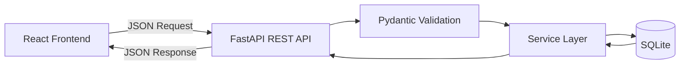
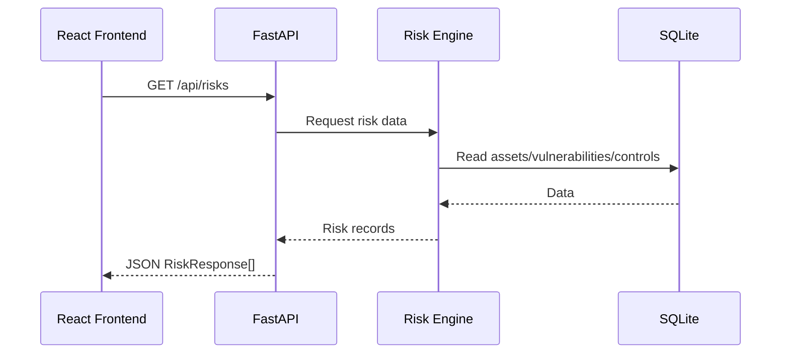
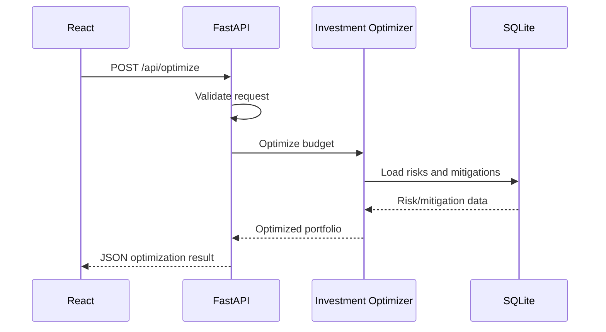
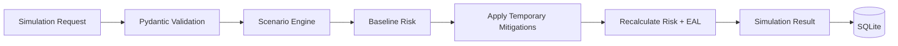
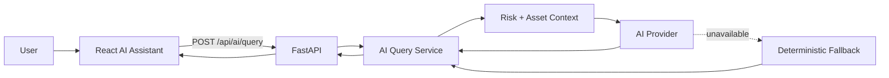

# CyberQuant AI — REST API Specification

## 1. Overview

This document defines the REST API contract between the **React + Vite + TypeScript frontend** and the **FastAPI backend**.

The API uses:

- **HTTP/HTTPS**
- **REST**
- **JSON**
- **FastAPI**
- **Pydantic validation**

The frontend communicates **only through these API endpoints**.

```text
React Frontend
      │
      │ REST / JSON
      ▼
 FastAPI API
      │
      ▼
 Service Layer
      │
      ▼
 SQLAlchemy
      │
      ▼
 SQLite
```

The frontend must **never directly access SQLite, SQLAlchemy models, or database connections**.

---

# 2. API Design Principles

1. All endpoints are prefixed with `/api`.
2. Request and response bodies use JSON.
3. Pydantic models define request and response contracts.
4. Backend services own business calculations.
5. The frontend owns presentation and visualization.
6. Database access is exclusively performed by the backend.
7. Errors use one consistent JSON structure.
8. IDs are represented as integers.
9. Timestamps use ISO 8601 format.
10. Financial values are represented as numbers in the configured currency, assumed to be INR for the MVP.
11. Risk probabilities and confidence values use `0–1`.
12. Risk scores use `0–100`.
13. API contracts should remain backward-compatible once implemented.

---

# 3. Base URL

Development:

```text
http://localhost:8000
```

API base path:

```text
/api
```

Example:

```text
GET http://localhost:8000/api/dashboard
```

---

# 4. Common Headers

## Request

```http
Content-Type: application/json
Accept: application/json
```

## Response

```http
Content-Type: application/json
```

---

# 5. Common Data Conventions

## Risk Score

Range:

```text
0–100
```

Interpretation:

```text
0–24    LOW
25–49   MEDIUM
50–74   HIGH
75–100  CRITICAL
```

## Probability

Range:

```text
0–1
```

Example:

```json
0.25
```

means 25% estimated probability.

## Confidence

Range:

```text
0–1
```

## Risk Reduction

Range:

```text
0–1
```

Example:

```json
0.40
```

means an expected 40% reduction.

## Money

Financial fields are numeric values.

Example:

```json
{
  "cost": 250000
}
```

The MVP assumes INR.

---

# 6. Common Pydantic Models

The following models define the stable JSON contract.

## 6.1 AssetResponse

```python
class AssetResponse(BaseModel):
    id: int
    name: str
    type: str
    business_unit: str
    criticality: str
    financial_value: float
    downtime_cost_per_hour: float
    internet_exposure: bool
    data_sensitivity: str
    description: str | None = None
```

---

## 6.2 VulnerabilityResponse

```python
class VulnerabilityResponse(BaseModel):
    id: int
    asset_id: int
    name: str
    cve: str | None = None
    cvss_score: float
    severity: str
    exploitability: float
    threat_activity: float
    status: str
```

---

## 6.3 RiskResponse

```python
class RiskResponse(BaseModel):
    id: int
    asset_id: int
    probability: float
    financial_impact: float
    eal: float
    risk_score: float
    confidence: float
    calculation_timestamp: datetime
    explanation: str
```

---

## 6.4 RecommendationResponse

```python
class RecommendationResponse(BaseModel):
    id: int
    risk_id: int
    action_name: str
    description: str
    cost: float
    expected_risk_reduction: float
    rosi: float
    priority: str
    implementation_time: int
```

---

## 6.5 FrameworkResponse

```python
class FrameworkResponse(BaseModel):
    id: int
    name: str
    version: str | None = None
    description: str | None = None
```

---

## 6.6 FrameworkControlResponse

```python
class FrameworkControlResponse(BaseModel):
    id: int
    framework_id: int
    control_name: str
    control_id: str
    description: str | None = None
```

---

# 7. Consistent Error Format

All API errors must use the same top-level structure.

```json
{
  "error": {
    "code": "VALIDATION_ERROR",
    "message": "Request validation failed",
    "details": [
      {
        "field": "budget",
        "message": "Budget must be greater than or equal to 0"
      }
    ],
    "request_id": "req_123456"
  }
}
```

## Error Fields

| Field | Type | Required | Purpose |
|---|---|---:|---|
| error.code | string | Yes | Machine-readable error code |
| error.message | string | Yes | Human-readable error |
| error.details | array | No | Field-specific information |
| error.request_id | string | Yes | Request identifier for debugging/logging |

---

# 8. Standard Error Codes

| Code | HTTP Status | Meaning |
|---|---:|---|
| `VALIDATION_ERROR` | 422 | Invalid request data |
| `BAD_REQUEST` | 400 | Invalid operation |
| `NOT_FOUND` | 404 | Requested resource does not exist |
| `CONFLICT` | 409 | Operation conflicts with current state |
| `DATABASE_ERROR` | 500 | Database operation failed |
| `INTERNAL_ERROR` | 500 | Unexpected backend error |
| `AI_UNAVAILABLE` | 503 | AI provider unavailable |
| `SERVICE_UNAVAILABLE` | 503 | Required backend service unavailable |

Internal exception messages and database details must never be exposed directly to the frontend.

---

# 9. GET `/api/dashboard`

## Purpose

Returns the complete executive dashboard summary.

This endpoint is optimized for the main CyberQuant AI dashboard and should return the information needed to render the page without requiring the frontend to calculate aggregate metrics.

## Query Parameters

Optional:

| Parameter | Type | Required | Description |
|---|---|---:|---|
| `business_unit` | string | No | Filter dashboard by business unit |
| `risk_level` | string | No | Filter by risk level |
| `days` | integer | No | Number of days used for trend |

Example:

```text
GET /api/dashboard?business_unit=Finance&days=30
```

## Request Body

None.

## Response

**200 OK**

```json
{
  "enterprise_risk_score": 72.4,
  "total_financial_exposure": 12500000,
  "critical_assets": 4,
  "critical_vulnerabilities": 11,
  "risk_trend": [
    {
      "date": "2026-08-29",
      "risk_score": 75.2
    },
    {
      "date": "2026-08-30",
      "risk_score": 74.1
    },
    {
      "date": "2026-08-31",
      "risk_score": 73.0
    },
    {
      "date": "2026-09-01",
      "risk_score": 72.4
    }
  ],
  "top_contributors": [
    {
      "asset_id": 1,
      "asset_name": "Payment Server",
      "risk_score": 91.2,
      "financial_exposure": 5000000
    },
    {
      "asset_id": 4,
      "asset_name": "Customer Database",
      "risk_score": 87.6,
      "financial_exposure": 3200000
    }
  ],
  "recommended_actions": [
    {
      "recommendation_id": 1,
      "action_name": "Patch critical vulnerabilities",
      "priority": "CRITICAL",
      "cost": 200000,
      "expected_risk_reduction": 0.55
    }
  ]
}
```

## Status Codes

```text
200 OK
422 Validation Error
500 Internal Server Error
```

## Validation

```text
days: 1–365
risk_level: LOW | MEDIUM | HIGH | CRITICAL
```

The backend calculates all aggregate values.

The frontend must not calculate `enterprise_risk_score`, `total_financial_exposure`, or contributor rankings itself.

---

# 10. GET `/api/assets`

## Purpose

Returns a list of enterprise assets.

## Query Parameters

| Parameter | Type | Required | Description |
|---|---|---:|---|
| `business_unit` | string | No | Filter by business unit |
| `criticality` | string | No | Filter by criticality |
| `internet_exposure` | boolean | No | Filter internet-exposed assets |
| `limit` | integer | No | Number of records |
| `offset` | integer | No | Pagination offset |

Example:

```text
GET /api/assets?criticality=CRITICAL&limit=20
```

## Request Body

None.

## Response

**200 OK**

```json
{
  "items": [
    {
      "id": 1,
      "name": "Payment Server",
      "type": "Application Server",
      "business_unit": "Finance",
      "criticality": "CRITICAL",
      "financial_value": 50000000,
      "downtime_cost_per_hour": 250000,
      "internet_exposure": true,
      "data_sensitivity": "RESTRICTED",
      "description": "Production payment processing server"
    }
  ],
  "total": 1,
  "limit": 20,
  "offset": 0
}
```

## Status Codes

```text
200 OK
422 Validation Error
```

## Validation

```text
limit: 1–100
offset: >= 0
criticality: LOW | MEDIUM | HIGH | CRITICAL
```

---

# 11. GET `/api/assets/{asset_id}`

## Purpose

Returns detailed information about a single asset.

## Path Parameter

```text
asset_id: integer
```

## Request Body

None.

## Response

**200 OK**

```json
{
  "id": 1,
  "name": "Payment Server",
  "type": "Application Server",
  "business_unit": "Finance",
  "criticality": "CRITICAL",
  "financial_value": 50000000,
  "downtime_cost_per_hour": 250000,
  "internet_exposure": true,
  "data_sensitivity": "RESTRICTED",
  "description": "Production payment processing server",
  "vulnerabilities": [
    {
      "id": 1,
      "name": "Remote Code Execution",
      "severity": "CRITICAL",
      "cvss_score": 9.8,
      "status": "OPEN"
    }
  ],
  "controls": [
    {
      "id": 1,
      "control_name": "Multi-Factor Authentication",
      "effectiveness": 0.85,
      "status": "IMPLEMENTED"
    }
  ],
  "latest_risk": {
    "risk_score": 87.5,
    "eal": 2500000,
    "confidence": 0.82
  }
}
```

## Status Codes

```text
200 OK
404 Not Found
422 Validation Error
```

## Validation

```text
asset_id must be a positive integer.
```

---

# 12. GET `/api/vulnerabilities`

## Purpose

Returns vulnerabilities affecting enterprise assets.

## Query Parameters

| Parameter | Type | Required | Description |
|---|---|---:|---|
| `asset_id` | integer | No | Filter by asset |
| `severity` | string | No | Filter by severity |
| `status` | string | No | Filter by status |
| `limit` | integer | No | Number of records |
| `offset` | integer | No | Pagination offset |

## Request Body

None.

## Response

**200 OK**

```json
{
  "items": [
    {
      "id": 1,
      "asset_id": 1,
      "name": "Remote Code Execution",
      "cve": "CVE-2026-0001",
      "cvss_score": 9.8,
      "severity": "CRITICAL",
      "exploitability": 0.9,
      "threat_activity": 0.8,
      "status": "OPEN"
    }
  ],
  "total": 1,
  "limit": 50,
  "offset": 0
}
```

## Status Codes

```text
200 OK
422 Validation Error
```

## Validation

```text
cvss_score: 0–10
exploitability: 0–1
threat_activity: 0–1
severity: LOW | MEDIUM | HIGH | CRITICAL
status: OPEN | MITIGATED | ACCEPTED | CLOSED
limit: 1–100
offset: >= 0
```

---

# 13. GET `/api/vulnerabilities/{id}`

## Purpose

Returns details of one vulnerability.

## Path Parameter

```text
id: integer
```

## Request Body

None.

## Response

**200 OK**

```json
{
  "id": 1,
  "asset_id": 1,
  "name": "Remote Code Execution",
  "cve": "CVE-2026-0001",
  "cvss_score": 9.8,
  "severity": "CRITICAL",
  "exploitability": 0.9,
  "threat_activity": 0.8,
  "status": "OPEN"
}
```

## Status Codes

```text
200 OK
404 Not Found
422 Validation Error
```

---

# 14. GET `/api/risks`

## Purpose

Returns calculated risk records.

## Query Parameters

| Parameter | Type | Required | Description |
|---|---|---:|---|
| `asset_id` | integer | No | Filter by asset |
| `min_score` | float | No | Minimum risk score |
| `max_score` | float | No | Maximum risk score |
| `limit` | integer | No | Number of records |
| `offset` | integer | No | Pagination offset |

## Request Body

None.

## Response

**200 OK**

```json
{
  "items": [
    {
      "id": 1,
      "asset_id": 1,
      "probability": 0.25,
      "financial_impact": 10000000,
      "eal": 2500000,
      "risk_score": 87.5,
      "confidence": 0.82,
      "calculation_timestamp": "2026-09-02T10:30:00Z",
      "explanation": "Critical internet-exposed asset with a high-severity exploitable vulnerability."
    }
  ],
  "total": 1,
  "limit": 50,
  "offset": 0
}
```

## Status Codes

```text
200 OK
422 Validation Error
```

## Validation

```text
asset_id > 0
min_score: 0–100
max_score: 0–100
min_score <= max_score
limit: 1–100
offset >= 0
```

---

# 15. GET `/api/risks/{id}`

## Purpose

Returns one calculated risk record.

## Path Parameter

```text
id: integer
```

## Response

**200 OK**

```json
{
  "id": 1,
  "asset_id": 1,
  "probability": 0.25,
  "financial_impact": 10000000,
  "eal": 2500000,
  "risk_score": 87.5,
  "confidence": 0.82,
  "calculation_timestamp": "2026-09-02T10:30:00Z",
  "explanation": "Critical internet-exposed asset with a high-severity exploitable vulnerability.",
  "mitigations": [
    {
      "id": 1,
      "action_name": "Patch Remote Code Execution Vulnerability",
      "cost": 200000,
      "expected_risk_reduction": 0.55,
      "rosi": 26.5,
      "priority": "CRITICAL"
    }
  ]
}
```

## Status Codes

```text
200 OK
404 Not Found
422 Validation Error
```

---

# 16. GET `/api/recommendations`

## Purpose

Returns security recommendations generated by the Recommendation Engine.

## Query Parameters

| Parameter | Type | Required | Description |
|---|---|---:|---|
| `priority` | string | No | Filter by priority |
| `risk_id` | integer | No | Filter by risk |
| `limit` | integer | No | Number of records |
| `offset` | integer | No | Pagination offset |

## Request Body

None.

## Response

**200 OK**

```json
{
  "items": [
    {
      "id": 1,
      "risk_id": 1,
      "action_name": "Patch Remote Code Execution Vulnerability",
      "description": "Apply the vendor security patch and verify remediation.",
      "cost": 200000,
      "expected_risk_reduction": 0.55,
      "rosi": 26.5,
      "priority": "CRITICAL",
      "implementation_time": 3
    }
  ],
  "total": 1,
  "limit": 50,
  "offset": 0
}
```

## Status Codes

```text
200 OK
422 Validation Error
```

## Validation

```text
priority: LOW | MEDIUM | HIGH | CRITICAL
risk_id > 0
limit: 1–100
offset >= 0
```

---

# 17. POST `/api/optimize`

## Purpose

Calculates the best security investment allocation for a given budget.

The Investment Optimizer runs on the backend.

The frontend sends a budget and optional constraints; it does not perform optimization itself.

## Request Body

```json
{
  "budget": 1000000,
  "risk_ids": [1, 2, 3],
  "max_recommendations": 5
}
```

## Pydantic Model

```python
class OptimizeRequest(BaseModel):
    budget: float = Field(ge=0)
    risk_ids: list[int] | None = None
    max_recommendations: int = Field(default=10, ge=1, le=50)
```

## Response

**200 OK**

```json
{
  "budget": 1000000,
  "allocated": 850000,
  "remaining": 150000,
  "baseline_eal": 5000000,
  "projected_eal": 2900000,
  "expected_loss_reduction": 2100000,
  "risk_reduction": 0.42,
  "recommendations": [
    {
      "mitigation_id": 1,
      "action_name": "Patch critical vulnerabilities",
      "cost": 200000,
      "expected_risk_reduction": 0.25,
      "rosi": 8.5,
      "priority": "CRITICAL"
    },
    {
      "mitigation_id": 3,
      "action_name": "Deploy endpoint protection",
      "cost": 650000,
      "expected_risk_reduction": 0.17,
      "rosi": 2.6,
      "priority": "HIGH"
    }
  ]
}
```

## Status Codes

```text
200 OK
400 Bad Request
404 Not Found
422 Validation Error
500 Internal Server Error
```

## Validation

```text
budget >= 0
risk_ids must contain positive integers
max_recommendations: 1–50
```

If no valid mitigation fits within the budget, return a successful response with an empty recommendation list.

---

# 18. POST `/api/simulate`

## Purpose

Runs a what-if cybersecurity scenario.

The simulation must not permanently modify the current database state.

## Request Body

```json
{
  "budget": 1000000,
  "mitigation_ids": [1, 3],
  "risk_ids": [1, 2]
}
```

## Pydantic Model

```python
class SimulateRequest(BaseModel):
    budget: float = Field(ge=0)
    mitigation_ids: list[int] = Field(default_factory=list)
    risk_ids: list[int] | None = None
```

## Response

**200 OK**

```json
{
  "simulation_id": 12,
  "baseline_exposure": 5000000,
  "selected_mitigations": [
    {
      "mitigation_id": 1,
      "action_name": "Patch critical vulnerabilities",
      "cost": 200000
    },
    {
      "mitigation_id": 3,
      "action_name": "Deploy endpoint protection",
      "cost": 650000
    }
  ],
  "resulting_exposure": 2900000,
  "risk_reduction": 0.42,
  "budget": 1000000,
  "timestamp": "2026-09-02T12:00:00Z"
}
```

## Status Codes

```text
200 OK
400 Bad Request
404 Not Found
422 Validation Error
500 Internal Server Error
```

## Validation

```text
budget >= 0
mitigation_ids must contain positive integers
risk_ids must contain positive integers
```

The backend must verify that every selected mitigation exists.

The backend should reject a simulation if the selected mitigation cost exceeds the supplied budget when the MVP simulation policy requires strict budget enforcement.

---

# 19. POST `/api/ai/query`

## Purpose

Answers natural-language cybersecurity questions using CyberQuant AI data and the configured AI provider.

## Request Body

```json
{
  "query": "Which assets have the highest financial exposure?",
  "context": {
    "asset_id": null
  }
}
```

## Pydantic Model

```python
class AIQueryRequest(BaseModel):
    query: str = Field(min_length=1, max_length=2000)
    context: dict[str, Any] | None = None
```

## Response

**200 OK**

```json
{
  "answer": "The Payment Server and Customer Database currently have the highest financial exposure.",
  "sources": [
    {
      "type": "asset",
      "id": 1,
      "name": "Payment Server"
    },
    {
      "type": "asset",
      "id": 4,
      "name": "Customer Database"
    }
  ],
  "ai_available": true
}
```

## AI Unavailable Response

The endpoint should still attempt a deterministic fallback.

```json
{
  "answer": "The Payment Server currently has the highest recorded financial exposure at ₹50,00,000.",
  "sources": [
    {
      "type": "asset",
      "id": 1,
      "name": "Payment Server"
    }
  ],
  "ai_available": false
}
```

The API can return:

```text
200 OK
```

when deterministic fallback successfully answers the query.

If neither the AI provider nor the fallback can answer:

```text
503 Service Unavailable
```

with:

```json
{
  "error": {
    "code": "AI_UNAVAILABLE",
    "message": "The AI assistant is temporarily unavailable",
    "request_id": "req_123456"
  }
}
```

## Status Codes

```text
200 OK
400 Bad Request
422 Validation Error
503 Service Unavailable
```

## Validation

```text
query length: 1–2000 characters
```

The backend must sanitize and validate context data before using it.

---

# 20. GET `/api/compliance/frameworks`

## Purpose

Returns the compliance/security frameworks supported by the platform.

The MVP includes NIST CSF.

Future frameworks can be added without changing this endpoint's response structure.

## Request Body

None.

## Response

**200 OK**

```json
{
  "items": [
    {
      "id": 1,
      "name": "NIST CSF",
      "version": "2.0",
      "description": "NIST Cybersecurity Framework"
    }
  ]
}
```

## Status Codes

```text
200 OK
```

---

# 21. GET `/api/compliance/{framework}`

## Purpose

Returns controls and mappings for a selected framework.

## Path Parameter

```text
framework: string
```

Examples:

```text
GET /api/compliance/NIST-CSF
GET /api/compliance/NIST%20CSF
```

The implementation should define one canonical framework identifier format. The recommended MVP format is the framework database ID or slug.

Recommended stable format:

```text
GET /api/compliance/nist-csf
```

## Response

**200 OK**

```json
{
  "framework": {
    "id": 1,
    "name": "NIST CSF",
    "version": "2.0"
  },
  "controls": [
    {
      "id": 1,
      "framework_id": 1,
      "control_name": "Multi-Factor Authentication",
      "control_id": "PR.AA-03",
      "description": "Users, services, and devices are authenticated commensurate with risk."
    },
    {
      "id": 2,
      "framework_id": 1,
      "control_name": "Data Security",
      "control_id": "PR.DS",
      "description": "Data is managed consistent with the organization's risk strategy."
    }
  ]
}
```

## Status Codes

```text
200 OK
404 Not Found
```

## Validation

```text
framework must be a valid non-empty identifier.
```

---

# 22. POST `/api/telemetry/refresh`

## Purpose

Refreshes synthetic cybersecurity telemetry.

For the MVP, this endpoint operates on synthetic data rather than requiring real SIEM, EDR, cloud, or vulnerability-scanner integrations.

The endpoint can:

1. Generate or load synthetic telemetry.
2. Normalize it.
3. Update the database.
4. Recalculate affected risk.
5. Return a refresh summary.

## Request Body

Optional:

```json
{
  "regenerate": true
}
```

## Pydantic Model

```python
class TelemetryRefreshRequest(BaseModel):
    regenerate: bool = True
```

## Response

**200 OK**

```json
{
  "status": "completed",
  "assets_processed": 15,
  "vulnerabilities_processed": 32,
  "controls_processed": 28,
  "risks_recalculated": 15,
  "timestamp": "2026-09-02T12:30:00Z"
}
```

## Status Codes

```text
200 OK
422 Validation Error
500 Internal Server Error
```

## Validation

```text
regenerate must be boolean.
```

---

# 23. API Endpoint Summary

| Method | Path | Purpose |
|---|---|---|
| GET | `/api/dashboard` | Executive risk dashboard |
| GET | `/api/assets` | List assets |
| GET | `/api/assets/{asset_id}` | Asset details |
| GET | `/api/vulnerabilities` | List vulnerabilities |
| GET | `/api/vulnerabilities/{id}` | Vulnerability details |
| GET | `/api/risks` | List risk records |
| GET | `/api/risks/{id}` | Risk details |
| GET | `/api/recommendations` | Security recommendations |
| POST | `/api/optimize` | Optimize security investment |
| POST | `/api/simulate` | Run what-if simulation |
| POST | `/api/ai/query` | Ask AI cybersecurity questions |
| GET | `/api/compliance/frameworks` | List frameworks |
| GET | `/api/compliance/{framework}` | Framework mappings |
| POST | `/api/telemetry/refresh` | Refresh synthetic telemetry |

---

# 24. Frontend Ownership vs Backend Ownership

## Frontend Owns

```text
Navigation
UI state
Charts
Tables
Filtering UI
Loading states
Presentation formatting
User interaction
```

## Backend Owns

```text
Risk calculations
EAL calculations
Financial impact calculations
ROSI calculations
Investment optimization
Scenario calculations
Recommendation generation
Compliance mapping
AI context retrieval
Database access
Persistence
Business validation
```

### Critical Rule

The frontend must never do this:

```text
React
  ↓
SQLite
```

or:

```text
React
  ↓
SQLAlchemy
```

The only supported communication path is:

```text
React
  ↓
REST / JSON
  ↓
FastAPI
  ↓
Services
  ↓
SQLAlchemy
  ↓
SQLite
```

---

# 25. Validation Strategy

Validation occurs at multiple levels.

## Level 1 — Pydantic

Validate request structure and basic constraints.

Example:

```python
budget: float = Field(ge=0)
risk_score: float = Field(ge=0, le=100)
```

## Level 2 — API Layer

Validate:

- IDs
- query parameters
- supported enum values
- pagination
- resource existence where appropriate

## Level 3 — Service Layer

Validate business rules.

Examples:

```text
Selected mitigation belongs to the requested risk
Budget is sufficient
Scenario parameters are logically consistent
```

## Level 4 — Database

Enforce:

```text
Primary keys
Foreign keys
NOT NULL constraints
Unique constraints
```

---

# 26. HTTP Status Code Policy

The API should use HTTP status codes consistently.

### 200 — OK

Successful GET and successful POST calculations.

### 201 — Created

Use if a future endpoint creates a persistent resource directly.

The current required endpoints do not need a `201` response.

### 400 — Bad Request

The request is syntactically valid but cannot be processed.

### 404 — Not Found

The requested resource does not exist.

### 409 — Conflict

The requested operation conflicts with current state.

### 422 — Validation Error

Pydantic/request validation failed.

### 500 — Internal Server Error

Unexpected backend or database failure.

### 503 — Service Unavailable

An external dependency, especially the AI provider, is unavailable and no fallback can satisfy the request.

---

# 27. Error Examples

## Validation Error

**HTTP 422**

```json
{
  "error": {
    "code": "VALIDATION_ERROR",
    "message": "Request validation failed",
    "details": [
      {
        "field": "budget",
        "message": "Input should be greater than or equal to 0"
      }
    ],
    "request_id": "req_001"
  }
}
```

## Resource Not Found

**HTTP 404**

```json
{
  "error": {
    "code": "NOT_FOUND",
    "message": "Asset with id 99 was not found",
    "request_id": "req_002"
  }
}
```

## Database Error

**HTTP 500**

```json
{
  "error": {
    "code": "DATABASE_ERROR",
    "message": "Unable to complete the requested operation",
    "request_id": "req_003"
  }
}
```

## AI Provider Unavailable

**HTTP 503**

```json
{
  "error": {
    "code": "AI_UNAVAILABLE",
    "message": "The AI assistant is temporarily unavailable",
    "request_id": "req_004"
  }
}
```

---

# 28. API Request Flow



---

# 29. Risk Analysis Flow



---

# 30. Optimization Flow



---

# 31. Simulation Flow



---

# 32. AI Query Flow



---

# 33. Stable API Contract

Once the MVP API is implemented, the following rules should be followed to prevent frontend/backend incompatibility.

## Do Not Rename Existing Fields

For example:

```text
risk_score
```

should not later become:

```text
score
```

without versioning or backward compatibility.

## Do Not Change Field Types

For example:

```json
"risk_score": 87.5
```

must remain numeric.

Do not change it to:

```json
"risk_score": "87.5"
```

## Do Not Remove Fields Without Versioning

Existing frontend fields should remain available.

## Additive Changes Are Preferred

New optional fields can be added when required.

Example:

```json
{
  "risk_score": 87.5,
  "confidence": 0.82,
  "trend": "decreasing"
}
```

Adding `trend` is safer than changing the existing fields.

## Endpoint Paths Should Remain Stable

The following paths form the MVP contract:

```text
/api/dashboard
/api/assets
/api/assets/{asset_id}
/api/vulnerabilities
/api/vulnerabilities/{id}
/api/risks
/api/risks/{id}
/api/recommendations
/api/optimize
/api/simulate
/api/ai/query
/api/compliance/frameworks
/api/compliance/{framework}
/api/telemetry/refresh
```

If a breaking change becomes unavoidable, introduce an explicit API version such as:

```text
/api/v2/...
```

rather than silently changing the existing contract.

---

# 34. API Documentation

FastAPI automatically exposes interactive API documentation.

Development endpoints:

```text
/docs
/redoc
```

The implementation should use Pydantic request/response models so that the generated OpenAPI specification accurately reflects this contract.

---

# 35. Final Architecture Rule

The API is the **single contract between frontend and backend**.

```text
                 CyberQuant AI
                      │
          ┌───────────┴───────────┐
          │                       │
     React Frontend          FastAPI Backend
          │                       │
          │       REST/JSON       │
          └───────────────────────┘
                                  │
                           Service Layer
                                  │
                             SQLAlchemy
                                  │
                               SQLite
```

The React application must never depend on internal SQLAlchemy models, database schemas, or service implementation details.

Only the documented JSON API is considered part of the frontend/backend contract.
