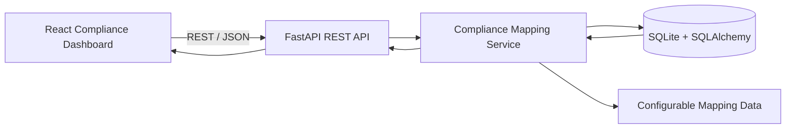
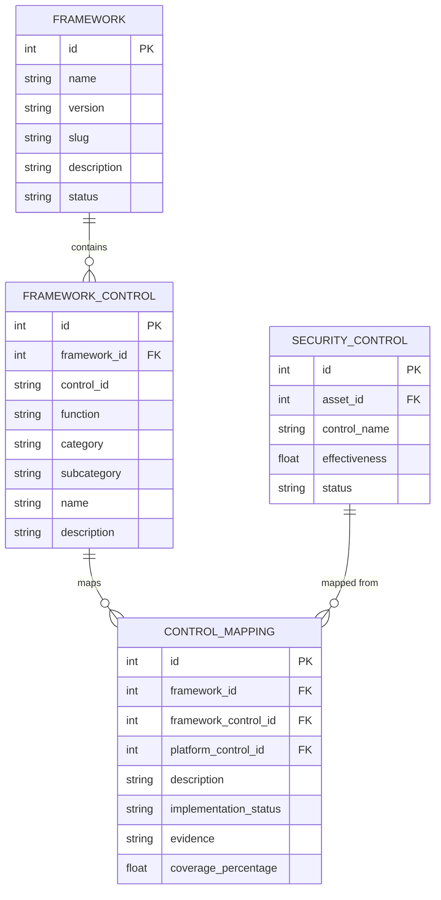
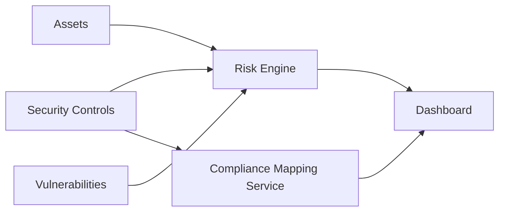
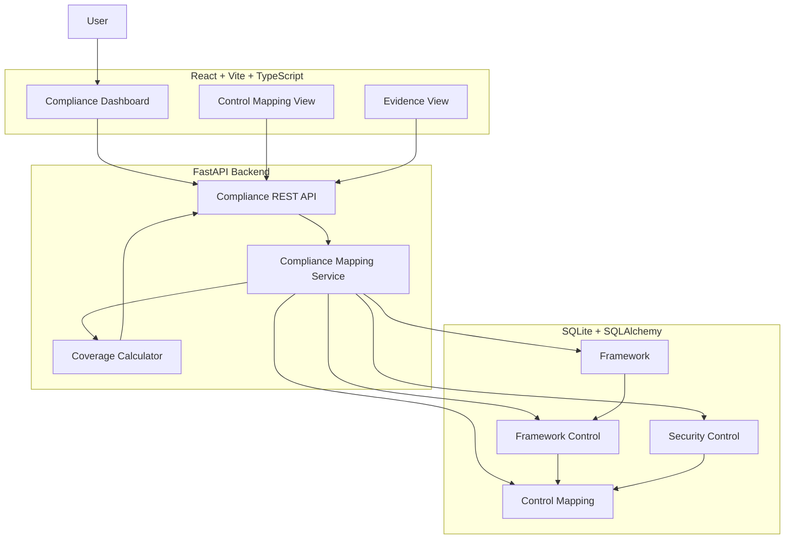

# CyberQuant AI — Compliance Mapping Architecture

## 1. Purpose

The CyberQuant AI compliance module maps the platform's security controls to recognized cybersecurity frameworks.

The SIH problem statement references:

- ISO/IEC 27001
- NIST Cybersecurity Framework (NIST CSF)
- CIS Controls
- RBI Cyber Security Framework
- SEBI Cybersecurity and Cyber Resilience Framework

For the MVP, **NIST CSF is the fully implemented representative framework**.

The architecture is intentionally framework-agnostic so additional frameworks can be added through configurable mapping data rather than application code changes.

> **Important:** The MVP demonstrates cybersecurity control-to-framework mapping capability. It is **not legal advice, regulatory certification, an audit opinion, or a claim of compliance** with any framework or regulation.

---

# 2. Objectives

The compliance mapping service must:

1. Store framework definitions.
2. Store framework controls/categories/subcategories.
3. Store CyberQuant platform security controls.
4. Map platform controls to framework controls.
5. Track implementation status.
6. Store evidence references.
7. Calculate framework coverage.
8. Expose compliance data through the REST API.
9. Display compliance status on the frontend.
10. Support future frameworks without rewriting the compliance engine.

---

# 3. High-Level Architecture



The frontend only consumes API responses.

The compliance calculation and mapping logic are owned by the backend.

---

# 4. Framework-Agnostic Design

The application must not contain logic such as:

```python
if framework == "NIST":
    ...
elif framework == "ISO":
    ...
```

throughout the application.

Instead, framework information is represented as data:

```text
Framework
    |
    +-- Framework Controls
            |
            +-- Control Mappings
                    |
                    +-- Platform Security Controls
```

This allows a future framework to be introduced by adding framework metadata, framework controls, and mapping records.

---

# 5. Core Concepts

## 5.1 Framework

A cybersecurity or compliance framework supported by the platform.

Examples:

```text
NIST CSF
ISO/IEC 27001
CIS Controls
RBI Cyber Security Framework
SEBI Cybersecurity and Cyber Resilience Framework
```

## 5.2 Framework Control

A specific framework requirement, category, control, or subcategory.

For NIST CSF, a framework control can contain:

- Function
- Category
- Subcategory
- Control identifier
- Description

## 5.3 Platform Security Control

A security control implemented or tracked by CyberQuant AI.

Examples:

```text
Multi-Factor Authentication
Vulnerability Scanning
Centralized Security Monitoring
Incident Response Plan
Data Encryption
Backup and Recovery
```

## 5.4 Mapping

A relationship between a framework control and a CyberQuant platform control.

Example:

```text
NIST:
PR.AA-03

        maps to

CyberQuant:
Multi-Factor Authentication
```

## 5.5 Implementation Status

The current state of the mapped platform control.

Supported MVP values:

```text
IMPLEMENTED
PARTIAL
MISSING
```

---

# 6. NIST CSF MVP

The MVP uses a representative subset of NIST CSF mappings.

The implementation should cover representative controls in these areas:

1. Identity and Access Management
2. Vulnerability Management
3. Security Monitoring
4. Incident Response
5. Data Protection
6. Recovery

The MVP does not need to implement every NIST CSF category or subcategory.

---

# 7. Representative NIST Mapping

The following mapping dataset is illustrative and should be validated against the selected NIST CSF version before being used for formal assessment.

## 7.1 Identity and Access Management

| Framework | Category | Subcategory | Platform Control | Status | Coverage |
|---|---|---|---|---|---:|
| NIST CSF | Protect / Identity Management, Authentication and Access Control | PR.AA | Multi-Factor Authentication | IMPLEMENTED | 100% |
| NIST CSF | Protect / Identity Management, Authentication and Access Control | PR.AA | Privileged Access Management | PARTIAL | 50% |
| NIST CSF | Protect / Identity Management, Authentication and Access Control | PR.AA | Role-Based Access Control | IMPLEMENTED | 100% |

## 7.2 Vulnerability Management

| Framework | Category | Subcategory | Platform Control | Status | Coverage |
|---|---|---|---|---|---:|
| NIST CSF | Identify / Risk Assessment | ID.RA | Vulnerability Scanning | IMPLEMENTED | 100% |
| NIST CSF | Identify / Risk Assessment | ID.RA | Vulnerability Prioritization | PARTIAL | 50% |
| NIST CSF | Protect / Technology Infrastructure Resilience | PR.IR | Patch Management | PARTIAL | 50% |

## 7.3 Security Monitoring

| Framework | Category | Subcategory | Platform Control | Status | Coverage |
|---|---|---|---|---|---:|
| NIST CSF | Detect / Continuous Monitoring | DE.CM | Centralized Security Monitoring | IMPLEMENTED | 100% |
| NIST CSF | Detect / Adverse Event Analysis | DE.AE | Security Event Analysis | PARTIAL | 50% |
| NIST CSF | Detect / Continuous Monitoring | DE.CM | Endpoint Monitoring | IMPLEMENTED | 100% |

## 7.4 Incident Response

| Framework | Category | Subcategory | Platform Control | Status | Coverage |
|---|---|---|---|---|---:|
| NIST CSF | Respond / Incident Management | RS.MA | Incident Response Process | IMPLEMENTED | 100% |
| NIST CSF | Respond / Incident Analysis | RS.AN | Incident Investigation | PARTIAL | 50% |
| NIST CSF | Respond / Incident Reporting and Communication | RS.CO | Incident Communication Plan | MISSING | 0% |

## 7.5 Data Protection

| Framework | Category | Subcategory | Platform Control | Status | Coverage |
|---|---|---|---|---|---:|
| NIST CSF | Protect / Data Security | PR.DS | Data Encryption | IMPLEMENTED | 100% |
| NIST CSF | Protect / Data Security | PR.DS | Data Backup | PARTIAL | 50% |
| NIST CSF | Protect / Data Security | PR.DS | Data Loss Prevention | MISSING | 0% |

## 7.6 Recovery

| Framework | Category | Subcategory | Platform Control | Status | Coverage |
|---|---|---|---|---|---:|
| NIST CSF | Recover / Incident Recovery Plan Execution | RC.RP | Disaster Recovery Plan | IMPLEMENTED | 100% |
| NIST CSF | Recover / Incident Recovery Communication | RC.CO | Recovery Communication Plan | PARTIAL | 50% |
| NIST CSF | Recover / Incident Recovery Plan Execution | RC.RP | Recovery Testing | PARTIAL | 50% |

---

# 8. Mapping Record Schema

Each mapping should contain the following logical fields.

| Field | Type | Required | Description |
|---|---|---:|---|
| `id` | integer | Yes | Mapping identifier |
| `framework_id` | integer | Yes | Framework reference |
| `framework_control_id` | integer | Yes | Framework control reference |
| `platform_control_id` | integer | Yes | CyberQuant control reference |
| `description` | string | Yes | Mapping explanation |
| `implementation_status` | enum | Yes | IMPLEMENTED, PARTIAL, or MISSING |
| `evidence` | string | No | Evidence or evidence reference |
| `coverage_percentage` | float | Yes | 0–100 coverage |
| `created_at` | datetime | Yes | Creation timestamp |
| `updated_at` | datetime | Yes | Last update timestamp |

---

# 9. Evidence

Evidence is intentionally lightweight in the MVP.

Examples:

```text
"Asset inventory shows MFA enabled for privileged users."
"Latest vulnerability scan completed on 2026-09-01."
"Incident response procedure documented in internal policy."
"Backup verification report available."
```

Evidence may initially be stored as text.

A future version can introduce a dedicated evidence repository or document storage system.

The MVP should not claim that textual evidence alone proves regulatory compliance.

---

# 10. Coverage Calculation

Coverage is calculated by the backend.

For a framework containing `N` mapped controls:

```text
Coverage % =
    (sum of control coverage percentages / N)
```

For the MVP, a simpler status-based interpretation can also be used:

```text
IMPLEMENTED = 100%
PARTIAL      = 50%
MISSING      = 0%
```

Therefore:

```text
Coverage % =
    (
      implemented_controls * 100
      + partial_controls * 50
      + missing_controls * 0
    )
    / total_controls
```

Example:

```text
Implemented = 10
Partial     = 4
Missing     = 2

Coverage =
((10 × 100) + (4 × 50) + (2 × 0)) / 16

= 75%
```

If an individual mapping contains an explicitly calculated coverage percentage, that value should take precedence over the default status-derived value.

---

# 11. Compliance Dashboard

The compliance dashboard should display:

```text
NIST Coverage %
Implemented Controls
Partial Controls
Missing Controls
```

Example:

```json
{
  "framework": "NIST CSF",
  "coverage_percentage": 72.5,
  "implemented_controls": 12,
  "partial_controls": 5,
  "missing_controls": 3,
  "total_controls": 20
}
```

---

# 12. Dashboard Visualization

Recommended MVP layout:

```text
┌──────────────────────────────────────────────┐
│ NIST CSF Coverage                            │
│                                              │
│                 72.5%                       │
│                                              │
├──────────────┬──────────────┬───────────────┤
│ Implemented  │ Partial      │ Missing       │
│     12       │      5       │      3        │
└──────────────┴──────────────┴───────────────┘
```

A framework control table should show:

```text
Control ID
Category
Control
Platform Control
Status
Coverage
Evidence
```

---

# 13. Backend Service

The `ComplianceMappingService` owns compliance-related calculations.

Recommended responsibilities:

```text
get_frameworks()
get_framework_controls(framework)
get_mappings(framework)
calculate_coverage(framework)
get_control_status(framework)
get_missing_controls(framework)
get_partial_controls(framework)
```

Example conceptual flow:

```python
framework = get_framework("nist-csf")
mappings = get_mappings(framework)

coverage = calculate_coverage(mappings)
```

The service should not contain framework-specific business logic.

Framework-specific information belongs in database/configuration records.

---

# 14. API Integration

The compliance architecture is exposed through the REST API.

## List Frameworks

```http
GET /api/compliance/frameworks
```

Example:

```json
{
  "items": [
    {
      "id": 1,
      "name": "NIST CSF",
      "version": "2.0",
      "status": "MVP"
    },
    {
      "id": 2,
      "name": "ISO/IEC 27001",
      "version": null,
      "status": "PLANNED"
    }
  ]
}
```

## Get Framework

```http
GET /api/compliance/nist-csf
```

Example:

```json
{
  "framework": {
    "id": 1,
    "name": "NIST CSF",
    "version": "2.0"
  },
  "summary": {
    "coverage_percentage": 72.5,
    "implemented_controls": 12,
    "partial_controls": 5,
    "missing_controls": 3
  },
  "controls": [
    {
      "control_id": "PR.AA",
      "category": "Identity Management",
      "description": "Identity and access management control.",
      "platform_control": "Multi-Factor Authentication",
      "implementation_status": "IMPLEMENTED",
      "coverage_percentage": 100,
      "evidence": "MFA enabled for privileged accounts."
    }
  ]
}
```

---

# 15. Database Architecture

The compliance system uses the existing MVP database entities:

```text
Framework
FrameworkControl
SecurityControl
```

The relationships are:

```text
Framework
    │
    │ 1:N
    ▼
FrameworkControl
    │
    │ mapped to
    ▼
SecurityControl
```

The mapping relationship should be represented in a configurable mapping structure.

For the MVP, this can be implemented as a mapping association model if the existing database schema supports it.

No separate table is required for every framework.

---

# 16. Mermaid ER Diagram



---

# 17. Configurable Mapping Data

Mappings should be stored as seed/configuration data rather than embedded throughout service code.

Example JSON:

```json
[
  {
    "framework": "nist-csf",
    "framework_control": "PR.AA",
    "platform_control": "Multi-Factor Authentication",
    "description": "Maps MFA implementation to identity and access protection.",
    "implementation_status": "IMPLEMENTED",
    "coverage_percentage": 100
  },
  {
    "framework": "nist-csf",
    "framework_control": "ID.RA",
    "platform_control": "Vulnerability Scanning",
    "description": "Maps vulnerability scanning to risk assessment.",
    "implementation_status": "IMPLEMENTED",
    "coverage_percentage": 100
  }
]
```

The same structure can later contain ISO, CIS, RBI, and SEBI mappings.

---

# 18. Seed Data Strategy

The MVP should seed the database during development/startup.

Recommended sequence:

```text
1. Create database
2. Create framework records
3. Create framework control records
4. Create platform security controls
5. Create mapping records
6. Create implementation statuses
7. Create evidence examples
```

Example:

```text
NIST CSF
   ↓
NIST categories/subcategories
   ↓
CyberQuant security controls
   ↓
Mapping records
   ↓
Coverage calculation
```

Seed data should be deterministic so every developer and hackathon judge can reproduce the same baseline.

---

# 19. Suggested NIST Seed Dataset

A minimal seed dataset can contain approximately:

```text
1 framework
6 control areas
12–20 representative framework controls
8–15 platform security controls
12–20 mappings
```

This is sufficient to demonstrate:

- implemented controls
- partial controls
- missing controls
- framework coverage
- evidence display
- control mapping
- dashboard visualization

The MVP does not need exhaustive NIST coverage.

---

# 20. Implementation Status

Use a controlled enum:

```text
IMPLEMENTED
PARTIAL
MISSING
```

Optional future status:

```text
NOT_ASSESSED
NOT_APPLICABLE
```

The MVP should keep the status model simple.

---

# 21. Mapping Rules

A mapping should be considered valid only when:

```text
framework exists
AND
framework control exists
AND
platform control exists
```

A mapping should not be duplicated for the same combination unless the application intentionally supports multiple assessment records.

Recommended uniqueness constraint:

```text
(framework_control_id, platform_control_id)
```

---

# 22. Coverage Rules

Coverage must be calculated server-side.

The frontend must not calculate:

```text
NIST Coverage %
Implemented Controls
Partial Controls
Missing Controls
```

The backend returns the calculated values.

This ensures that:

```text
Dashboard
Risk Analysis
Compliance
AI Assistant
```

all consume the same source of truth.

---

# 23. Compliance and Risk Integration

Compliance data can be combined with the risk engine.

Example:



A missing or partially implemented security control can therefore be surfaced alongside the associated cybersecurity risk.

Example:

```text
Risk:
Payment Server — HIGH

Related control:
Multi-Factor Authentication — PARTIAL

Recommendation:
Complete MFA rollout
```

This provides a useful connection between:

```text
Risk → Control → Compliance → Recommendation
```

---

# 24. AI Assistant Integration

The AI Query Service may use compliance data when answering questions.

Example user query:

```text
"Which NIST controls are missing?"
```

The AI service should retrieve structured compliance data from the backend rather than inventing framework mappings.

Expected answer:

```text
There are 3 missing mapped NIST controls in the current MVP assessment.
```

For framework-specific claims, the AI should rely on the stored mapping data.

The AI layer must not fabricate:

- framework controls
- compliance status
- evidence
- certification
- legal conclusions

---

# 25. Error Handling

## Framework Not Found

```http
404 Not Found
```

```json
{
  "error": {
    "code": "NOT_FOUND",
    "message": "Framework 'unknown-framework' was not found",
    "request_id": "req_123"
  }
}
```

## Mapping Data Error

```http
500 Internal Server Error
```

```json
{
  "error": {
    "code": "COMPLIANCE_MAPPING_ERROR",
    "message": "Unable to load compliance mapping data",
    "request_id": "req_124"
  }
}
```

## Invalid Framework Identifier

```http
422 Unprocessable Entity
```

```json
{
  "error": {
    "code": "VALIDATION_ERROR",
    "message": "Invalid framework identifier",
    "details": [
      {
        "field": "framework",
        "message": "Framework identifier must be a valid slug"
      }
    ],
    "request_id": "req_125"
  }
}
```

---

# 26. Future Framework Support

The architecture should reserve framework records for:

## ISO/IEC 27001

```text
framework: iso-27001
status: PLANNED
```

## CIS Controls

```text
framework: cis-controls
status: PLANNED
```

## RBI Cyber Security Framework

```text
framework: rbi-cyber-security
status: PLANNED
```

## SEBI Cybersecurity and Cyber Resilience Framework

```text
framework: sebi-cybersecurity
status: PLANNED
```

Adding these frameworks should require:

```text
Add framework record
        ↓
Add framework control records
        ↓
Add mapping records
        ↓
Existing compliance service works
```

No rewrite of the React compliance page or compliance calculation engine should be required.

---

# 27. Future Multi-Framework Dashboard

The same API structure can eventually support:

```text
┌─────────────────────────────────────────────┐
│ Compliance Overview                         │
├──────────────┬──────────────┬───────────────┤
│ NIST CSF     │ ISO 27001    │ CIS Controls  │
│ 72%          │ 65%          │ 81%           │
├──────────────┼──────────────┼───────────────┤
│ RBI          │ SEBI         │               │
│ Planned      │ Planned      │               │
└──────────────┴──────────────┴───────────────┘
```

The UI can select a framework dynamically:

```text
GET /api/compliance/{framework}
```

---

# 28. Framework Versioning

Framework records should contain a `version` field.

Example:

```text
NIST CSF
version = 2.0
```

This is important because framework structures can change over time.

Mappings should always identify the framework/version they were created for.

Example:

```text
framework = NIST CSF
version = 2.0
control = PR.AA
```

This prevents mappings from silently changing when a framework publishes a new version.

---

# 29. Auditability

Compliance calculations should be reproducible.

The system should retain:

```text
framework
framework version
control
platform control
implementation status
coverage percentage
evidence
updated timestamp
```

This allows the application to explain:

```text
Why is this control considered implemented?
```

and:

```text
How was the coverage percentage calculated?
```

The MVP does not need a full audit-log subsystem unless required elsewhere in the application.

---

# 30. Security Considerations

Compliance evidence may contain sensitive organizational information.

For the MVP:

- Do not store credentials in evidence.
- Do not expose secrets through API responses.
- Validate framework identifiers.
- Validate mapping IDs.
- Avoid arbitrary file paths in evidence.
- Log compliance operations without sensitive payloads.
- Keep database access server-side.

---

# 31. What the MVP Does Not Claim

The CyberQuant AI MVP does **not** claim:

- ISO/IEC 27001 certification
- NIST certification
- CIS compliance certification
- RBI regulatory compliance
- SEBI regulatory compliance
- Legal compliance
- Audit readiness
- Regulatory approval
- Completeness of any framework mapping

The compliance module is a **demonstration of control mapping and coverage analysis**.

Formal compliance requires authoritative framework interpretation, organizational context, appropriate evidence, assessment procedures, and potentially independent audit or regulatory review.

---

# 32. Recommended MVP Implementation

Implement the compliance feature in this order:

```text
Step 1
Create Framework model

Step 2
Create FrameworkControl model

Step 3
Use existing SecurityControl model

Step 4
Create configurable control mappings

Step 5
Seed representative NIST CSF data

Step 6
Implement ComplianceMappingService

Step 7
Implement coverage calculation

Step 8
Expose:
GET /api/compliance/frameworks
GET /api/compliance/{framework}

Step 9
Build React compliance dashboard

Step 10
Connect compliance context to AI Assistant
```

---

# 33. Final Architecture



---

# 34. Summary

The CyberQuant AI compliance architecture uses a **data-driven framework mapping model**.

The MVP fully demonstrates a representative **NIST CSF mapping** covering:

- Identity and Access Management
- Vulnerability Management
- Security Monitoring
- Incident Response
- Data Protection
- Recovery

The architecture separates:

```text
Framework definitions
        ↓
Framework controls
        ↓
Platform security controls
        ↓
Configurable mappings
        ↓
Implementation status
        ↓
Coverage calculation
        ↓
REST API
        ↓
Compliance Dashboard
```

Future frameworks such as ISO/IEC 27001, CIS Controls, RBI, and SEBI can be added by loading new framework/control/mapping data without rewriting the core compliance application.

The MVP is intended to demonstrate **traceable cybersecurity control mapping and coverage analysis**, not formal legal, regulatory, or certification compliance.
