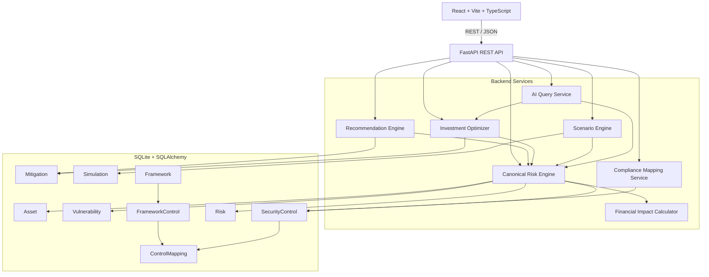

# CyberQuant AI — Technical Specification Consistency Review

## Review Scope

This review checks the CyberQuant AI specification for internal consistency before application implementation.

Requested source set:

- `AGENTS.md`
- `docs/00-project-overview.md`
- `docs/01-product-requirements.md`
- `docs/02-architecture.md`
- `docs/03-database-schema.md`
- `docs/04-risk-engine.md`
- `docs/05-api-specification.md`
- `docs/06-frontend-specification.md`
- `docs/07-ai-decision-engine.md`
- `docs/08-investment-optimizer.md`
- `docs/09-compliance-mapping.md`
- `docs/10-demo-data.md`
- `docs/11-development-plan.md`

### Source availability note

The available project library contains the CyberQuant documents from `00` through `10`, but `AGENTS.md`, `docs/01-product-requirements.md`, and `docs/11-development-plan.md` were not available under those names at review time.

Therefore:

- The consistency review below covers all available CyberQuant specification documents.
- Conclusions involving the missing three files are explicitly marked as **unverified**.
- No application files were modified.
- No application code was written.

The available documents identify `docs/04-risk-engine.md` as the authoritative source for risk calculations and `docs/05-api-specification.md` as the stable frontend/backend contract.

---

# 1. Executive Summary

The specification has a strong hackathon MVP foundation:

```text
React
  ↓
FastAPI
  ↓
Service Layer
  ↓
SQLAlchemy
  ↓
SQLite
```

The core product story is coherent:

```text
Technical evidence
      ↓
Financial risk
      ↓
Prioritized remediation
      ↓
Budget optimization
      ↓
Scenario analysis
      ↓
AI explanation
```

However, the specification is **not yet implementation-ready**.

The most important blockers are:

1. **Mitigation risk-reduction units conflict across database, optimizer, API, and demo data.**
2. **Compliance mapping requirements need a real mapping relationship that the database schema does not currently provide.**
3. **The dashboard API is missing fields required by the frontend, especially enterprise EAL and richer top-contributor data.**
4. **The risk API does not expose enough structured calculation data for the frontend explainability requirements.**
5. **The optimizer's current input/output contract differs from the stable API contract.**
6. **The demo optimizer numbers are not directly connected to the canonical risk-engine scenario calculation.**
7. **Scenario simulation and optimizer both use additive financial risk reduction assumptions, while the risk engine requires re-running the canonical risk pipeline.**
8. **Some frontend requirements depend on APIs that are not currently specified.**
9. **The compliance NIST mapping examples contain conceptual/versioning ambiguity and should be treated as representative demo mappings rather than formal compliance claims.**

---

# 2. Severity Definitions

## Critical

Blocks implementation or can produce materially incorrect results.

## Important

Does not necessarily block the first code commit but creates a significant integration, correctness, or demo risk.

## Minor

Mostly documentation, naming, polish, or future-proofing issues that should be cleaned up before finalizing the MVP.

---

# 3. Critical Issues

## C1 — Mitigation Risk Reduction Has Conflicting Units

### Files

- `docs/03-database-schema.md`
- `docs/05-api-specification.md`
- `docs/08-investment-optimizer.md`
- `docs/10-demo-data.md`

### Issue

The database schema defines:

```text
Mitigation.expected_risk_reduction
Type: Float
Constraint: 0–1
Description: Expected percentage reduction
```

The optimizer defines the same field as a **financial INR amount**.

For example, the optimizer uses:

```json
{
  "expected_risk_reduction": 1000000
}
```

and explicitly states that it represents expected financial risk reduction in INR.

The demo data also uses INR:

```text
MIT-001 = ₹1,00,00,000
MIT-002 = ₹90,00,000
MIT-007 = ₹55,00,000
```

But the API recommendation example uses:

```json
"expected_risk_reduction": 0.55
```

which looks like a percentage/fraction.

### Why It Matters

The same field cannot safely mean both:

```text
0.55 = 55%
```

and:

```text
0.55 = ₹0.55
```

or:

```text
55,00,000 = ₹55 lakh
```

This would cause incorrect:

- optimizer rankings
- ROSI
- scenario results
- dashboard numbers
- AI explanations

### Recommended Change

Define two separate concepts:

```text
expected_risk_reduction_percentage
    0–1

expected_financial_risk_reduction
    INR
```

For the MVP optimizer, use:

```text
expected_financial_risk_reduction_inr
```

as the authoritative optimization value.

The database schema, optimizer, API, demo data, and AI specification must use the same unit.

---

## C2 — Compliance Mapping Is Not Represented in the Current Database Model

### Files

- `docs/03-database-schema.md`
- `docs/09-compliance-mapping.md`

### Issue

`docs/09-compliance-mapping.md` defines a `CONTROL_MAPPING` relationship:

```text
FrameworkControl
        ↓
ControlMapping
        ↓
SecurityControl
```

with fields such as:

```text
framework_control_id
platform_control_id
implementation_status
evidence
coverage_percentage
```

But `docs/03-database-schema.md` only defines:

```text
Framework
FrameworkControl
SecurityControl
```

and `FrameworkControl` has:

```text
control_name
control_id
description
```

It has no:

```text
security_control_id
implementation_status
evidence
coverage_percentage
```

The database document also explicitly says:

> No separate table is required for every framework.

and currently treats `FrameworkControl` as the mapping structure.

### Why It Matters

The required NIST dashboard cannot reliably answer:

```text
Which platform control maps to this NIST control?
Is it implemented?
What evidence supports it?
What is its coverage percentage?
```

without a defined relationship.

### Recommended Change

Choose one canonical design.

**Recommended:**

Add a `ControlMapping` association table:

```text
Framework
    1:N
FrameworkControl
    1:N
ControlMapping
    N:1
SecurityControl
```

with:

```text
id
framework_control_id
security_control_id
description
implementation_status
evidence
coverage_percentage
```

This is not an unnecessary table; it represents a genuine mapping relationship and allows one framework requirement to map to multiple platform controls.

---

## C3 — Dashboard API Does Not Fully Support the Frontend Dashboard

### Files

- `docs/05-api-specification.md`
- `docs/06-frontend-specification.md`

### Issue

The frontend requires dashboard metrics including:

```text
Enterprise Risk Score
Total Financial Exposure
Expected Annual Loss
Critical Assets
Critical Vulnerabilities
Risk Trend
Top Financial Risk Contributors
Risk Reduction Opportunities
```

The API dashboard response includes:

```text
enterprise_risk_score
total_financial_exposure
critical_assets
critical_vulnerabilities
risk_trend
top_contributors
recommended_actions
```

but does **not explicitly return enterprise EAL**.

The frontend also expects top contributors to contain:

```text
asset
business unit
risk level
financial exposure/EAL
primary risk driver
vulnerability count
```

while the API example only returns:

```text
asset_id
asset_name
risk_score
financial_exposure
```

### Why It Matters

The frontend would have to make additional undocumented requests or reconstruct values locally.

That violates the frontend source-of-truth rule.

### Recommended Change

Add an authoritative dashboard response:

```json
{
  "enterprise_risk_score": 72.4,
  "total_financial_exposure": 12500000,
  "enterprise_eal": 12500000,
  "critical_assets": 4,
  "critical_vulnerabilities": 11,
  "risk_trend": [],
  "top_contributors": [
    {
      "asset_id": 1,
      "asset_name": "Payment Gateway",
      "business_unit": "Payments",
      "risk_level": "CRITICAL",
      "eal": 5000000,
      "primary_risk_driver": "SQL Injection",
      "vulnerability_count": 4
    }
  ],
  "recommended_actions": []
}
```

Also define whether:

```text
total_financial_exposure
```

and:

```text
enterprise_eal
```

are intentionally identical in the MVP or represent different concepts.

---

## C4 — Risk API Does Not Expose the Explainability Data Required by the Frontend

### Files

- `docs/04-risk-engine.md`
- `docs/05-api-specification.md`
- `docs/06-frontend-specification.md`

### Issue

The risk engine requires explainability information including:

```text
input values
normalized values
intermediate values
final result
major risk drivers
assumptions
```

The frontend explicitly requires:

```text
CVSS
asset criticality
internet exposure
exploitability
threat activity
data sensitivity
control effectiveness
financial-impact inputs
Base Probability
Pre-Control Probability
Incident Probability
EAL
Assumptions
Confidence/data completeness
Major risk drivers
```

But the API `RiskResponse` only contains:

```text
probability
financial_impact
eal
risk_score
confidence
calculation_timestamp
explanation
```

### Why It Matters

The frontend cannot implement the specified explainability panel from this response without duplicating calculations or making undocumented backend calls.

### Recommended Change

Add a structured explanation object:

```json
{
  "inputs": {
    "cvss": 9.8,
    "criticality": 5,
    "internet_exposure": 1,
    "exploitability": 0.9,
    "threat_activity": 0.8,
    "data_sensitivity": 1,
    "control_effectiveness": 0.2
  },
  "intermediate": {
    "base_probability": 0.393,
    "risk_multiplier": 1.72,
    "pre_control_probability": 0.676,
    "incident_probability": 0.541
  },
  "financial_impact_components": {
    "downtime": 1000000,
    "data_breach": 5000000,
    "recovery": 1000000,
    "regulatory": 0,
    "reputation_business": 500000
  },
  "major_risk_drivers": [
    "CVSS",
    "internet_exposure",
    "asset_criticality"
  ],
  "assumptions": []
}
```

The frontend should render this structure without implementing the formula itself.

---

## C5 — Optimizer Contract Conflicts With the Stable API Contract

### Files

- `docs/05-api-specification.md`
- `docs/08-investment-optimizer.md`

### Issue

The stable API specifies:

```text
POST /api/optimize
```

while the optimizer document contains:

```text
POST /api/optimization
```

The optimizer response also uses:

```text
selected_investments
total_investment
before_exposure
after_exposure
```

while the API response uses:

```text
recommendations
allocated
remaining
baseline_eal
projected_eal
expected_loss_reduction
risk_reduction
```

### Why It Matters

The frontend and backend could implement different contracts even though both documents appear to describe the same endpoint.

### Recommended Change

Make `docs/05-api-specification.md` authoritative.

Use:

```text
POST /api/optimize
```

and define one canonical response model.

The optimizer document should reference the API contract instead of defining a competing endpoint schema.

---

# 4. Important Issues

## I1 — Optimizer Is Not Yet Tightly Coupled to the Canonical Risk Engine

### Files

- `docs/04-risk-engine.md`
- `docs/08-investment-optimizer.md`

### Issue

The risk engine is the authoritative source for:

```text
probability
financial impact
EAL
```

The optimizer receives pre-calculated:

```text
expected_risk_reduction
```

and treats it as an input.

The optimizer document does state that these values should originate from the risk model, but it does not define a concrete service boundary that calculates the post-mitigation risk from the canonical engine.

### Why It Matters

Two different sources could eventually produce:

```text
baseline EAL
```

and:

```text
expected risk reduction
```

leading to inconsistent results.

### Recommended Change

Define this pipeline explicitly:

```text
Risk Engine
    ↓
Baseline Risk
    ↓
Apply Mitigation Model
    ↓
Risk Engine / Mitigation Evaluation
    ↓
Financial Risk Reduction
    ↓
Optimizer
```

The optimizer should select among backend-generated mitigation outcomes rather than independently inventing reductions.

---

## I2 — Scenario Simulation and Optimizer Use Different Risk-Reduction Models

### Files

- `docs/04-risk-engine.md`
- `docs/08-investment-optimizer.md`
- `docs/10-demo-data.md`

### Issue

The risk engine says scenarios must:

```text
change inputs
→ rerun canonical risk pipeline
→ calculate scenario EAL
```

The optimizer instead uses:

```text
After Exposure =
max(0, Before Exposure - Expected Risk Reduction)
```

The demo data uses the same additive subtraction approach.

### Why It Matters

A mitigation can affect:

- probability
- control effectiveness
- vulnerability status
- exposure

rather than simply subtracting a fixed INR amount.

The two approaches can therefore produce different results.

### Recommended Change

Use two clearly defined layers:

```text
Risk Engine:
calculates scenario EAL from changed security state.

Optimizer:
uses precomputed marginal financial risk-reduction values
generated from the same scenario/risk model.
```

For the MVP, precompute mitigation effects once from the canonical engine and make the optimizer consume those values.

---

## I3 — Mitigation Model Does Not Support the Optimizer's Affected-Asset/Affected-Risk Requirements

### Files

- `docs/03-database-schema.md`
- `docs/08-investment-optimizer.md`
- `docs/10-demo-data.md`

### Issue

The optimizer requires every investment to contain:

```text
affected_assets
affected_risks
```

The database `Mitigation` only has:

```text
risk_id
```

and therefore represents one mitigation as belonging to one risk.

The demo data nevertheless describes mitigation actions as enterprise investments affecting multiple assets and risks.

### Why It Matters

For example:

```text
Enterprise MFA Rollout
```

can reasonably affect multiple assets and multiple risks.

A single:

```text
risk_id
```

does not adequately represent that relationship.

### Recommended Change

For the hackathon MVP, avoid overcomplicating the schema by using JSON fields:

```text
affected_assets: JSON
affected_risks: JSON
```

on `Mitigation`.

Alternatively, if the implementation requires strong relational integrity, add junction tables later.

For the MVP, JSON is consistent with the existing lightweight-schema philosophy.

---

## I4 — Asset Detail API Does Not Fully Match the Frontend Asset Requirements

### Files

- `docs/05-api-specification.md`
- `docs/06-frontend-specification.md`

### Issue

The frontend asset detail requires:

```text
control effectiveness
total EAL
vulnerability count
major risk drivers
recommended mitigations
```

The API example contains vulnerabilities, controls, and latest risk, but does not explicitly provide:

```text
vulnerability_count
major_risk_drivers
recommended_mitigations
total_eal
```

### Why It Matters

The asset detail page would need to derive these values from nested data or make additional undocumented requests.

### Recommended Change

Add these fields directly to the asset detail response.

---

## I5 — Vulnerability API Does Not Provide Risk/EAL Data Required by the Frontend Vulnerability View

### Files

- `docs/05-api-specification.md`
- `docs/06-frontend-specification.md`

### Issue

The frontend vulnerability page wants:

```text
CVSS
incident probability
financial impact
EAL
severity
major risk driver
```

The vulnerability response only contains:

```text
CVSS
severity
exploitability
threat_activity
status
```

### Why It Matters

The UI cannot display the required financial risk view from the specified endpoint.

### Recommended Change

Either:

1. extend `VulnerabilityResponse` with the latest calculated risk metrics, or
2. explicitly state that the frontend joins vulnerability records with `/api/risks`.

For a hackathon MVP, extending the response is simpler and faster.

---

## I6 — Risk Trend Has No Clearly Defined Persistence Source

### Files

- `docs/04-risk-engine.md`
- `docs/05-api-specification.md`
- `docs/06-frontend-specification.md`
- `docs/03-database-schema.md`

### Issue

The frontend requires historical risk trends.

The database stores timestamped `Risk` snapshots, which is good.

However, the API does not explicitly define:

```text
which risk snapshot is used
how enterprise historical values are aggregated
whether the trend is based on EAL or risk score
```

### Why It Matters

Different implementations could produce different trends.

### Recommended Change

Define:

```text
Risk trend =
one canonical enterprise aggregation per calculation timestamp.
```

Return both when useful:

```json
{
  "date": "...",
  "risk_score": 72.4,
  "eal": 12500000
}
```

---

## I7 — Enterprise Risk Score Reference Exposure Needs One Explicit MVP Configuration

### Files

- `docs/04-risk-engine.md`
- `docs/10-demo-data.md`

### Issue

The risk engine correctly defines:

```text
Risk Score =
min(100, 100 × Exposure / ReferenceExposure)
```

and says `ReferenceExposure` must be configured.

However, the demo data and API examples do not establish a single canonical reference value.

### Why It Matters

The same EAL can produce different enterprise risk scores depending on the configured reference exposure.

### Recommended Change

Define one deterministic MVP configuration:

```text
RISK_REFERENCE_EXPOSURE_INR = <documented demo value>
```

and state where it is configured.

---

## I8 — Confidence Is Semantically Different From the API's Generic `confidence`

### Files

- `docs/04-risk-engine.md`
- `docs/05-api-specification.md`
- `docs/06-frontend-specification.md`
- `docs/07-ai-decision-engine.md`

### Issue

The risk engine defines confidence as:

```text
data completeness
```

not model accuracy.

The API simply exposes:

```text
confidence
```

### Why It Matters

A frontend or AI response could incorrectly interpret this as:

```text
82% probability the model is correct
```

### Recommended Change

Rename or supplement the field:

```text
data_completeness
```

or document prominently:

```text
confidence = input-data completeness, not model accuracy
```

The second option avoids an API-breaking rename.

---

## I9 — NIST Framework Version and Control Identifiers Need One Canonical Dataset

### Files

- `docs/09-compliance-mapping.md`
- `docs/10-demo-data.md`

### Issue

The compliance document describes mappings such as:

```text
PR.AA
PR.DS
DE.CM
RS.MA
RC.RP
```

while the example text also refers to:

```text
PR.AA-03
```

The database uses a generic `control_id`.

### Why It Matters

The application needs one canonical representation of:

```text
function
category
subcategory
control identifier
version
```

otherwise NIST records may become inconsistent.

### Recommended Change

Define the NIST seed data as versioned structured records:

```text
framework = NIST CSF
version = 2.0
function = Protect
category = Identity Management
subcategory = ...
control_id = PR.AA-...
```

Keep the actual mapping dataset centralized.

---

## I10 — AI Can Explain Backend Values, but Structured Source Data Is Incomplete

### Files

- `docs/07-ai-decision-engine.md`
- `docs/04-risk-engine.md`
- `docs/05-api-specification.md`

### Issue

The AI specification correctly says:

> Numbers in the response must exactly match the structured source data.

This is good.

However, the API does not currently return all the structured intermediate data the AI explanation requirements call for.

### Why It Matters

The AI service may be forced to reconstruct values or query undocumented internal objects.

That creates a risk of AI/backend disagreement.

### Recommended Change

Define an internal structured risk context object shared by:

```text
Risk API
AI Query Service
Recommendation Engine
Optimizer
Scenario Engine
```

Example:

```text
RiskContext
├── inputs
├── normalized_inputs
├── intermediate_values
├── financial_impact
├── eal
├── risk_score
├── drivers
├── assumptions
└── data_completeness
```

The AI should explain this object rather than recalculate anything.

---

# 5. Minor Issues

## M1 — Architecture API Examples Use Old/Alternative Routes

### File

`docs/02-architecture.md`

### Issue

Architecture examples include:

```text
/api/risk/analyze
/api/risk/summary
/api/optimizer/optimize
/api/scenarios/simulate
/api/compliance/mappings
```

while the stable API document defines:

```text
/api/risks
/api/risks/{id}
/api/optimize
/api/simulate
/api/compliance/frameworks
/api/compliance/{framework}
```

### Why It Matters

Developers may follow the architecture document instead of the stable API contract.

### Recommended Change

Replace all architecture endpoint examples with the endpoints in `docs/05-api-specification.md`.

---

## M2 — Financial Exposure and EAL Need a Single Terminology Policy

### Files

- `docs/00-project-overview.md`
- `docs/04-risk-engine.md`
- `docs/05-api-specification.md`
- `docs/08-investment-optimizer.md`

### Issue

The documents sometimes use:

```text
financial exposure
EAL
expected risk reduction
financial risk reduction
```

as if they were interchangeable.

### Why It Matters

Executives and developers may interpret these metrics differently.

### Recommended Change

Define:

```text
Financial Impact
= loss if the modeled incident occurs

EAL
= annualized expected loss

Enterprise Exposure
= canonical enterprise aggregate of modeled EAL

Risk Score
= normalized 0–100 communication metric
```

Then use those terms consistently.

---

## M3 — Database Schema Stores EAL as a Snapshot but Does Not Explicitly Store Calculation Inputs

### File

`docs/03-database-schema.md`

### Issue

`Risk` stores:

```text
probability
financial_impact
eal
risk_score
confidence
explanation
```

but not the calculation inputs.

### Why It Matters

Historical explainability may be difficult if asset/vulnerability/control values later change.

### Recommended Change

For a strict MVP, this can remain as-is if the application stores enough information in `explanation`.

A stronger but still lightweight option is a JSON:

```text
calculation_inputs
```

on `Risk`.

This is useful for reproducible historical explanations but is not a blocker if time is limited.

---

## M4 — Simulation Persistence Is Underspecified

### File

`docs/03-database-schema.md`

### Issue

The database stores:

```text
baseline_exposure
selected_mitigations
resulting_exposure
risk_reduction
budget
timestamp
```

but the scenario API also discusses:

```text
affected assets
affected vulnerabilities
changed assumptions
```

### Recommended Change

Either add a JSON:

```text
scenario_parameters
```

or explicitly state that these details are not persisted in the MVP.

---

## M5 — API Pagination Is Not Uniformly Documented

### File

`docs/05-api-specification.md`

### Issue

List endpoints use:

```text
limit
offset
```

but response structures are not formally standardized across all list endpoints.

### Recommended Change

Use one reusable response shape:

```json
{
  "items": [],
  "total": 0,
  "limit": 50,
  "offset": 0
}
```

---

## M6 — Frontend Stack Is Slightly Larger Than the Core Architecture

### Files

- `docs/02-architecture.md`
- `docs/06-frontend-specification.md`

### Issue

The architecture says:

```text
React + Vite + TypeScript
```

while the frontend specification adds:

```text
Tailwind CSS
Recharts
Axios
Lucide React
```

These are reasonable, but they should be treated as frontend libraries rather than architecture-level infrastructure.

### Recommended Change

Keep them in the frontend specification only and explicitly mark them as optional implementation libraries except for Axios/Recharts if the MVP depends on them.

---

# 6. Requirement-by-Requirement Consistency Check

## 1. Do database entities support all API requirements?

### Status: **Partially**

Supported well:

```text
Assets
Vulnerabilities
Security Controls
Risks
Mitigations
Simulations
Frameworks
Framework Controls
```

Problems:

- Mitigation does not represent multiple affected assets/risks cleanly.
- Compliance mapping relationship is missing.
- Risk explainability fields are not persisted.
- Some API response aggregates are calculated rather than directly stored, which is fine, but the service contract must define them.

### Recommendation

Resolve C1, C2, and I3 before implementation.

---

## 2. Do API responses support every dashboard requirement?

### Status: **No**

Missing or incomplete:

```text
Enterprise EAL
Business unit on contributors
Risk level on contributors
Primary risk driver
Vulnerability count
```

### Recommendation

Resolve C3.

---

## 3. Are the risk formulas consistent everywhere?

### Status: **Mostly, but not fully**

The canonical risk engine is internally coherent:

```text
Base Probability
→ Risk Multiplier
→ Pre-Control Probability
→ Control Effectiveness
→ Incident Probability
→ Financial Impact
→ EAL
```

and:

```text
EAL = Probability × Financial Impact
```

Enterprise exposure is:

```text
Σ canonical asset/risk EAL
```

Enterprise risk score is:

```text
min(100, 100 × Exposure / ReferenceExposure)
```

The main inconsistency is between the canonical risk engine and optimizer/demo subtraction of fixed financial risk-reduction amounts.

### Recommendation

Resolve C1 and I2.

---

## 4. Does the optimizer use the risk engine's outputs?

### Status: **Conceptually yes; contractually incomplete**

The optimizer says it must consume risk-model outputs, but the mitigation dataset contains independent fixed reductions.

### Recommendation

Make the risk engine the producer of mitigation-effect estimates.

---

## 5. Can scenario simulation reuse the same risk engine?

### Status: **Yes**

This is one of the stronger parts of the specification.

The risk engine explicitly requires:

```text
scenario changes
→ same deterministic risk pipeline
→ scenario EAL
```

### Recommendation

Preserve this design and make the optimizer use the same mitigation-effect calculation.

---

## 6. Can the AI explain values produced by the backend?

### Status: **Yes conceptually; incomplete structurally**

The AI specification correctly prohibits inventing values and recalculating them.

However, the API needs richer structured risk context.

### Recommendation

Resolve C4 and I10.

---

## 7. Does the demo data support the intended demo narrative?

### Status: **Yes, with numerical consistency risk**

The demo data deliberately supports:

```text
Customer Database
Payment Gateway
IAM Server
Cloud Storage
Kubernetes
ERP
Public API
```

and provides:

```text
₹5 lakh budget
```

with a deterministic greedy recommendation.

This strongly supports the intended hackathon story.

However, the optimizer's fixed INR reductions must be reconciled with the canonical risk engine.

### Recommendation

Keep the narrative but generate/validate its financial outcomes from the same risk calculation pipeline.

---

## 8. Does NIST mapping fit the database model?

### Status: **No**

The conceptual model is correct, but the current schema lacks the actual mapping association required by the compliance specification.

### Recommendation

Resolve C2.

---

## 9. Are frontend requirements supported by backend APIs?

### Status: **Partially**

The main flows exist:

```text
Dashboard
Assets
Risk Analysis
Optimizer
Scenario
Compliance
AI
```

But several required fields are missing from API responses.

### Recommendation

Resolve C3, C4, I4, and I5.

---

## 10. Are there contradictory requirements?

### Status: **Yes**

Most significant contradictions:

### Contradiction A

```text
expected_risk_reduction = 0–1
```

versus:

```text
expected_risk_reduction = INR
```

### Contradiction B

```text
POST /api/optimize
```

versus:

```text
POST /api/optimization
```

### Contradiction C

```text
Scenario = rerun risk engine
```

versus:

```text
After Exposure = Before Exposure - fixed reduction
```

### Contradiction D

```text
FrameworkControl maps controls
```

versus:

```text
ControlMapping is the mapping relationship
```

### Contradiction E

Architecture endpoint examples differ from the stable API specification.

---

## 11. Are there unnecessary technologies?

### Status: **No major unnecessary infrastructure**

The architecture is appropriately simple:

```text
React
Vite
TypeScript
FastAPI
Pydantic
SQLAlchemy
SQLite
```

The future technologies:

```text
PostgreSQL
Kafka/RabbitMQ
cloud deployment
streaming
ML
real telemetry connectors
```

are correctly marked as future architecture.

The frontend libraries:

```text
Tailwind
Recharts
Axios
Lucide
```

are reasonable for the MVP.

### Recommendation

Do not add:

```text
Redis
Kafka
PostgreSQL
Kubernetes
microservices
ML pipelines
vector databases
```

to the MVP unless a concrete requirement emerges.

---

## 12. Are any requirements too large for an SIH MVP?

### Status: **Yes, several should be constrained**

The core MVP is realistic.

The following should remain deliberately limited:

### Real telemetry

The project overview mentions many possible integrations:

```text
SIEM
EDR
IAM
CSPM
CMDB
cloud providers
vulnerability scanners
```

Do not implement these all.

Use synthetic telemetry and perhaps one mocked ingestion path.

### ML-based risk modeling

The project overview mentions statistical/ML-based likelihood modeling, while the risk engine is deterministic.

The deterministic model is appropriate for the MVP.

Do not add ML before the deterministic pipeline works.

### Compliance

Do not attempt complete:

```text
ISO 27001
CIS
RBI
SEBI
```

mapping.

NIST representative mapping is sufficient.

### AI

Implement a small number of grounded queries:

```text
highest financial risk
biggest EAL contributor
what should we fix first
budget-based recommendation
```

Do not build a general autonomous security agent.

### Continuous streaming

Do not implement production streaming infrastructure.

A synthetic refresh endpoint is enough for the demo.

---

# 7. Recommended Canonical Architecture After Fixes

The specification should converge on this model:



The important design rule is:

```text
Risk Engine = numerical source of truth
Optimizer = deterministic selection engine
Scenario Engine = risk-engine scenario runner
AI = explanation/query layer
Compliance = data-driven mapping layer
Frontend = presentation/interaction layer
```

---

# 8. Recommended MVP Decision Rules

Before implementation, freeze these rules:

## Rule 1 — One Financial Unit

All financial risk reductions:

```text
INR
```

## Rule 2 — One Risk Formula

```text
EAL = Incident Probability × Financial Impact
```

## Rule 3 — One Enterprise Aggregation

```text
Enterprise EAL =
sum of canonical non-duplicated modeled risk EALs
```

## Rule 4 — One Risk Score Formula

```text
Risk Score =
min(100, 100 × Enterprise EAL / ReferenceExposure)
```

## Rule 5 — One Scenario Engine

All scenario results must reuse the canonical risk pipeline.

## Rule 6 — Optimizer Does Not Recalculate Risk

It consumes mitigation effects generated from the risk model.

## Rule 7 — AI Does Not Calculate Risk

It explains structured backend results.

## Rule 8 — Frontend Does Not Calculate Business Metrics

It renders API results.

## Rule 9 — Compliance Is Data-Driven

Framework mappings are seed/configuration data.

## Rule 10 — Synthetic Data Is Explicitly Labeled

No synthetic finding or financial value may be presented as a real organization's security state.

---

# 9. Recommended Pre-Implementation Checklist

The project should **not start full implementation** until these are resolved:

- [ ] Fix `expected_risk_reduction` units.
- [ ] Choose the canonical optimizer endpoint: `/api/optimize`.
- [ ] Freeze one optimizer response schema.
- [ ] Add/define the compliance mapping relationship.
- [ ] Add missing dashboard API fields.
- [ ] Add structured risk explainability fields.
- [ ] Define asset-detail API fields.
- [ ] Define vulnerability-to-risk API relationship.
- [ ] Define canonical enterprise trend aggregation.
- [ ] Define `ReferenceExposure`.
- [ ] Define mitigation effects from the canonical risk engine.
- [ ] Align optimizer and scenario calculations.
- [ ] Freeze NIST framework version and seed dataset.
- [ ] Replace alternative endpoint examples in `02-architecture.md`.
- [ ] Resolve or obtain `AGENTS.md`.
- [ ] Resolve or obtain `docs/01-product-requirements.md`.
- [ ] Resolve or obtain `docs/11-development-plan.md`.
- [ ] Run one final cross-document terminology review.

---

# 10. Critical Issues

1. **Mitigation risk-reduction unit mismatch**
   - `docs/03-database-schema.md`
   - `docs/05-api-specification.md`
   - `docs/08-investment-optimizer.md`
   - `docs/10-demo-data.md`

2. **Missing compliance mapping relationship**
   - `docs/03-database-schema.md`
   - `docs/09-compliance-mapping.md`

3. **Dashboard API incomplete for frontend requirements**
   - `docs/05-api-specification.md`
   - `docs/06-frontend-specification.md`

4. **Risk API insufficient for explainability**
   - `docs/04-risk-engine.md`
   - `docs/05-api-specification.md`
   - `docs/06-frontend-specification.md`

5. **Optimizer endpoint/response contract mismatch**
   - `docs/05-api-specification.md`
   - `docs/08-investment-optimizer.md`

---

# 11. Important Issues

1. Optimizer should consume mitigation effects produced by the canonical risk engine.
2. Scenario and optimizer financial reduction models need alignment.
3. Mitigation affected-assets/affected-risks relationships are underspecified.
4. Asset detail response is incomplete.
5. Vulnerability response is incomplete for the frontend risk view.
6. Risk trend aggregation is underspecified.
7. `ReferenceExposure` needs one frozen demo configuration.
8. Confidence/data-completeness terminology needs to be explicit.
9. NIST control identifiers/version need one canonical seed dataset.
10. AI needs a structured backend risk context.

---

# 12. Minor Issues

1. Architecture contains outdated/alternative endpoint names.
2. Financial terminology should be normalized.
3. Historical risk inputs could be stored for stronger reproducibility.
4. Simulation persistence fields should be clarified.
5. Pagination should use one reusable API convention.
6. Frontend libraries should remain implementation-level dependencies rather than architecture infrastructure.

---

# 13. Overall Readiness Score

## **72 / 100**

### Score breakdown

| Area | Score |
|---|---:|
| Overall architecture | 90/100 |
| MVP scope | 85/100 |
| Risk-engine definition | 90/100 |
| Database foundation | 75/100 |
| API contract | 70/100 |
| Frontend/backend alignment | 68/100 |
| Optimizer consistency | 60/100 |
| Scenario consistency | 70/100 |
| AI grounding | 78/100 |
| Compliance architecture | 65/100 |
| Demo-data readiness | 85/100 |

### Interpretation

```text
90–100  Implementation ready
80–89   Minor cleanup required
70–79   Strong foundation, but blockers remain
60–69   Significant redesign required
<60     Not implementation ready
```

**72/100 means the architecture is strong enough to proceed with specification cleanup, but not yet safe to start unrestricted implementation.**

The most important work is not adding more features. It is making the existing contracts agree.

---

# 14. Final Recommendation

**Do not start full application implementation yet.**

First resolve the five critical contract problems:

```text
1. Financial risk-reduction units
2. Compliance mapping relationship
3. Dashboard API completeness
4. Structured risk explainability
5. Optimizer API contract
```

Then perform one short specification freeze.

After that, the MVP can be implemented around a clean deterministic pipeline:

```text
Synthetic Data
      ↓
Normalization
      ↓
Canonical Risk Engine
      ↓
Financial Impact + EAL
      ↓
Recommendations
      ↓
Mitigation Effects
      ↓
Investment Optimizer
      ↓
Scenario Engine
      ↓
REST API
      ↓
React Dashboard
      ↓
AI Explanation
```

This keeps the SIH MVP focused, explainable, reproducible, and small enough for a hackathon while preserving a credible path toward future production architecture.
